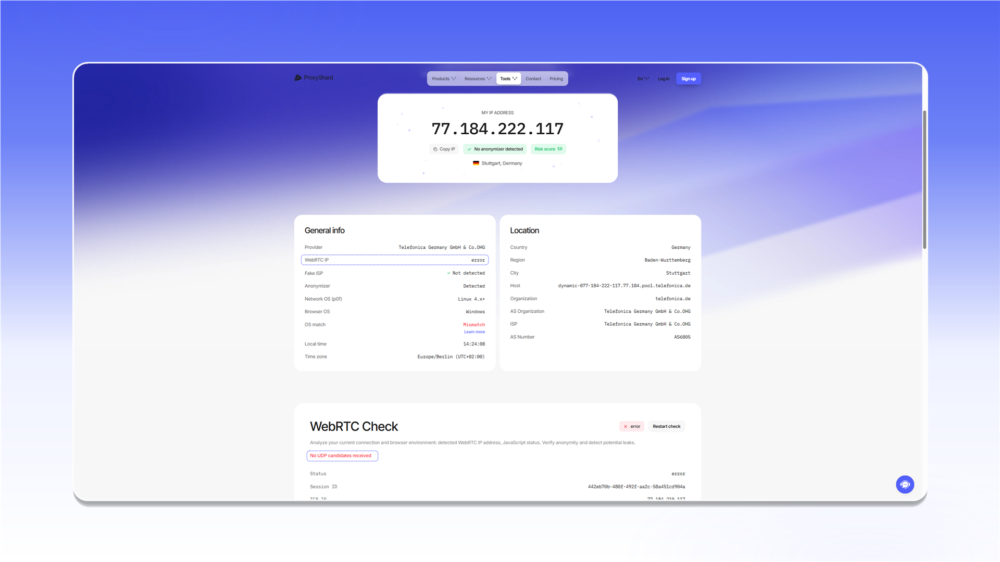

# How to check for WebRTC leaks

You can test WebRTC with ProxyShard IP Checker or the third-party Ipbinding service. Start with our tool: it shows the external IP, the WebRTC address, and the UDP test result in one report.

## 1. ProxyShard IP Checker



### Expected result

With a correct setup, `My IP address` and `WebRTC IP` match. This means WebRTC is using the proxy address and UDP traffic is not bypassing the connection.

<figure>
  <picture>
    <source srcset="../../.gitbook/assets/ip-checker-overview_black.png" media="(prefers-color-scheme: dark)">
    
  </picture>
</figure>

### No UDP candidates

If `WebRTC IP` shows `error` and the `WebRTC Check` section reports `No UDP candidates received`, the browser did not receive any UDP candidates.

<figure>
  <picture>
    <source srcset="../../.gitbook/assets/webrtc-check-failed_black.png" media="(prefers-color-scheme: dark)">
    
  </picture>
</figure>


This result does not indicate an IP leak by itself. WebRTC may be blocked, or the selected product or application may not carry UDP. Check [which products support UDP](./README.md#products-with-udp-support) and use [software that supports UDP ASSOCIATE](webrtc-software-solutions.md).



If `WebRTC IP` shows an address different from `My IP address`, WebRTC is bypassing the proxy. This result indicates a leak.


For a description of every field, see [IP Checker](../ip-checker.md).

## 2. Ipbinding

[Ipbinding](https://ipbinding.online/) also displays WebRTC candidates. Read the result the same way: the WebRTC address should match the proxy address.


