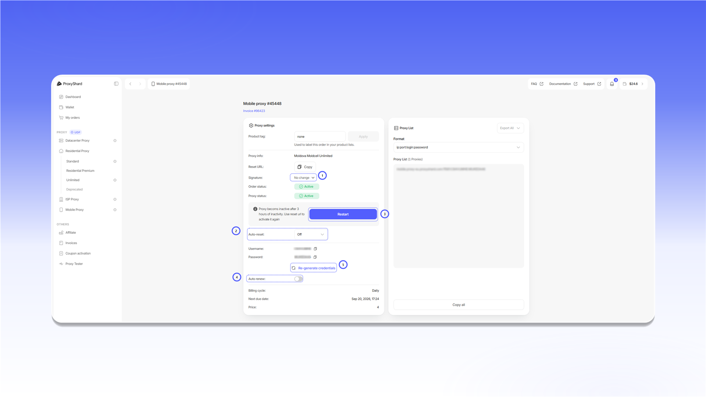

# Mobile proxies

<mark style="color:purple;">Mobile proxies</mark> are hosted on routers with real SIM cards. The type and quality of the connection are identical to ordinary mobile internet through a cellular operator - exactly like on your smartphone. They support <mark style="color:purple;">UDP</mark> and offer a rich choice of locations and operators.


**Mobile proxies work on any device.** The name "mobile" reflects only the connection method via a SIM card, not the type of end device. They work equally well on a PC, a laptop, or in an antidetect browser.



**A specific product - for those who understand why they need it.** Traffic goes through a real SIM card, so speed may vary - this is normal, not a malfunction. If you are not sure whether mobile proxies fit your task, ask in [live chat](../contact-us.md) or consider [ISP proxies](isp-proxies.md) (stable speed, home IPs) or [Residential proxies](residential-proxies/README.md) (a large pool, many sessions).



1\) Device fingerprint switching (p0f) is not available on all operators. See the full list of restrictions on the [Restrictions](restrictions.md) page.

2\) Not available to users in Russia without using a VPN.




Step-by-step purchase and activation guide: [Purchasing mobile proxies](../site-navigation/buying-and-renewing/buying-mobile-proxies.md).

## Characteristics

| Parameter      | Value                                 |
| -------------- | ------------------------------------- |
| IP type        | Mobile IPv4                           |
| Sharing        | No - one port per user                |
| Traffic        | Unlimited                             |
| [UDP support](about-udp/) | ✓                             |
| [p0f support](p0f-spoofing.md) | ✓ (not in all locations, see above) |
| Price          | from **$4** / day · from **$55** / month |

## Available locations

| Country | Operators |
| ------- | --------- |
| 🇺🇸 USA | T-Mobile (5G), Verizon (5G, Colorado) |
| 🇬🇧 United Kingdom | O2, Vodafone |
| 🇩🇪 Germany | O2, Vodafone |
| 🇫🇷 France | SFR (5G), Bouygues Telecom (5G) |
| 🇮🇹 Italy | Vodafone (5G), WindTre (5G) |
| 🇪🇸 Spain | Digimobil, Movistar (5G), Vodafone (5G) |
| 🇵🇹 Portugal | NOS (5G) |
| 🇳🇱 Netherlands | Ziggo (5G), Odido (5G) |
| 🇮🇪 Ireland | Vodafone (5G), Three (5G) |
| 🇵🇱 Poland | T-Mobile (5G) |
| 🇺🇦 Ukraine | Lifecell, Vodafone, Kyivstar |
| 🇲🇩 Moldova | Moldcell, Moldtelecom |
| 🇨🇦 Canada | Rogers |
| 🇮🇩 Indonesia | Telkomsel |


The list is regularly expanding. Up-to-date locations and pricing are on the purchase page [Mobile proxy](https://dashboard.proxyshard.com/en/mobile-proxy).


## How to purchase

1. Open `Mobile Proxy`.
2. Select a country using `Country filter`.
3. Choose the rental period in the card for the required operator.
4. Click `Buy`.

<figure>
  <picture>
    <source srcset="../.gitbook/assets/mobile-purchase-form_black.png" media="(prefers-color-scheme: dark)">
    
  </picture>
</figure>

Payment, initial activation, and renewal are covered in [Purchasing mobile proxies](../site-navigation/buying-and-renewing/buying-mobile-proxies.md).

## Order fields and controls

<figure>
  <picture>
    <source srcset="../.gitbook/assets/mobile-order-settings_black.png" media="(prefers-color-scheme: dark)">
    
  </picture>
</figure>

1. `Signature` selects the network signature. Available values are `w`, `w10`, `w7`, `linux`, `android`, `macos`, and `ios`. After changing the signature, click `Restart`.
2. `Auto-reset` restarts the connection automatically at the selected interval.
3. `Restart` activates the port or changes its IP. You can perform the same action through your personal `Reset URL`.
4. `Auto renew` renews the order automatically when the balance is sufficient.
5. `Re-generate credentials` creates new login credentials. Existing proxy connection strings stop working after this action.

Other fields:

* `Product tag` adds a label that you can use to find the order in your lists.
* `Proxy info` shows the country, operator, and plan type.
* `Order status` shows the order state: `Active`, `On-hold`, or `Canceled`.
* `Proxy status` shows the port state: `Active` or `Disconnected`.
* `Username` and `Password` contain the login credentials.
* `Billing cycle`, `Next due date`, and `Price` show the rental period and next payment.
* In `Proxy List`, you can select the connection string format, copy the list with `Copy all`, or download it with `Export All`.


After purchase and after three hours without activity, activate the port using `Restart` or `Reset URL`. The proxy does not work while `Proxy status` is `Disconnected`.


## What tasks they fit

Social media and multi-accounting, mobile ad verification, mobile ad checks, most crypto exchanges, Polymarket, testing mobile sites and apps, web scraping of mobile site versions, SEO monitoring of mobile results, e-commerce monitoring of mobile prices, geo-targeted content testing, travel scraping of mobile fares, brand monitoring in the mobile environment.

## Pros and cons of Mobile proxies

#### <mark style="color:green;">Pros:</mark>

* **Choice of a specific operator** - connect through the exact cellular provider you need
* **IP change via Reset URL** - rotation no more than once a minute
* **p0f support** - available in most locations (see [Restrictions](restrictions.md))
* **UDP support**
* **Flexible rental period** - from one day to a month
* **One user per port** - one SIM card, one user

#### <mark style="color:red;">Cons:</mark>

* **Possible speed drops** when the operator's cell tower is overloaded - rare, but possible
* **A complex product for beginners** - we recommend checking with [Support](../contact-us.md) before purchase
* **p0f spoofing on macOS / iOS** reduces channel speed due to the complexity of the algorithm
* **Dynamic IP** - the address may change at the operator's initiative at any moment
* **One session at a time** - one port holds one IP. If you need to connect several devices _simultaneously_ (not one after another, but at the same moment), buy a separate port or consider [Residential proxies](residential-proxies/README.md)


See the [setup guides](../setup-guides/getting-started.md) for proxy configuration instructions.

