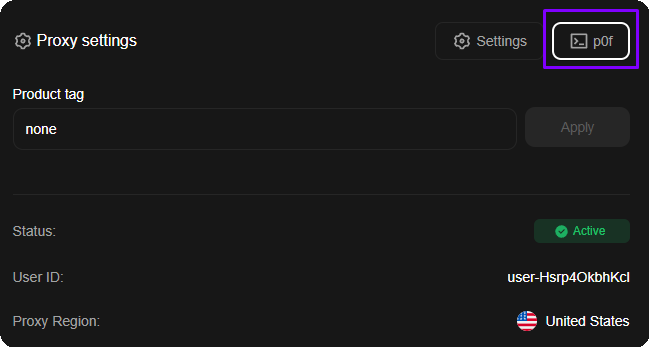
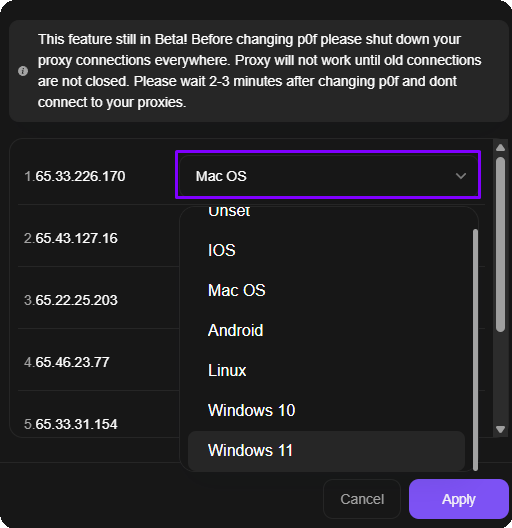

# Network fingerprint spoofing (p0f)

## What p0f is and why it matters

Every device on the network has its own digital fingerprint at the <mark style="color:$primary;">TCP/IP</mark> level, called <mark style="color:$primary;">**p0f**</mark>. It is formed from network stack parameters: MSS, TSval, TTL, TCP options, Window size, TOS, and others. These parameters differ across Windows, macOS, Linux, iOS, and Android, and anti-fraud systems know this.

How website-side checks work:

1. The website looks at the <mark style="color:$primary;">**User-Agent**</mark>, <mark style="color:$primary;">**TLS fingerprint**</mark>, and other client parameters to determine which OS the user came from.
2. In parallel, the <mark style="color:$primary;">**network layer**</mark> of the connection is analyzed, namely the <mark style="color:$primary;">TCP/IP fingerprint</mark> that the proxy server sends together with your traffic.
3. If the browser says “I am Windows 11”, but the TCP/IP fingerprint indicates <mark style="color:$primary;">Linux</mark>, the anti-fraud system records a mismatch.

**The problem with all proxy services is** that all Datacenter and ISP proxies run on Linux servers. This means that in 99% of cases your network fingerprint will be Linux, even though you are accessing from Windows or macOS. For anti-fraud systems, this is a direct signal that a proxy is being used.

## How ProxyShard solves this

We added the ability to **spoof the p0f fingerprint** directly from the dashboard. You select the required OS, and the proxy server starts sending network packets with the corresponding TCP/IP fingerprint.

Available spoofing options:

| Value          | Description                 |
| -------------- | --------------------------- |
| **Unset**      | Default fingerprint (Linux) |
| **Windows 10** | Windows 10 fingerprint      |
| **Windows 11** | Windows 11 fingerprint      |
| **Mac OS**     | macOS fingerprint           |
| **Linux**      | Linux fingerprint           |
| **iOS**        | iOS fingerprint             |
| **Android**    | Android fingerprint         |

### ISP proxy dashboard with p0f support

<figure><figcaption>
p0f tab in ISP proxy settings
</figcaption></figure>

### Fingerprint selection panel

Below is a screenshot of an example p0f setup from an ISP proxy order.

<figure><figcaption>
OS selection for network fingerprint spoofing
</figcaption></figure>


Before changing p0f, make sure to close all connections through the proxy. The proxy will not work until old connections are closed. After changing p0f, wait 2-3 minutes before connecting.


## Real results

Interim tests show a significant improvement in passing anti-fraud checks. One confirmed case:


**Google accounts:** together with the developer of [Vision Browser](../setup-guides/antidetect-browsers/vision-browser.md), we tested Google registration without modifying the browser fingerprint. On a clean profile without p0f spoofing, the system immediately offers QR-code verification. With p0f spoofing to Windows 10/11, the QR check no longer appears and Google requests phone-number verification - confirming the absence of proxy detection.


People who work with Google registrations know that without “breaking” the fingerprint on desktop, it is impossible to get phone-number verification: the system will always ask for QR. p0f spoofing solves this problem at the network level.

## Recommended stack

For maximum results, we recommend using:

* [**Vision Browser**](../setup-guides/antidetect-browsers/vision-browser.md), an antidetect browser with UDP support
* **ProxyShard ISP proxies** with p0f spoofing enabled

This stack covers all layers of checks: browser fingerprint (Vision) + network fingerprint (p0f) + clean IP from a home provider (ISP).

## Where it is available

p0f spoofing and device filtering are available on the following products:

* [Datacenter proxies](datacenter-proxies.md)
* [ISP proxies](isp-proxies.md)
* [Mobile proxies](mobile-proxies.md)
* [Premium Residential](residential-proxies/premium-residential.md) - device filtering through the [Device OS](residential-proxies/#settings-field-description) parameter, without p0f spoofing


p0f spoofing is not available on some [Mobile proxies](mobile-proxies.md). See the full list of restrictions on the [Limitations](restrictions.md) page.

