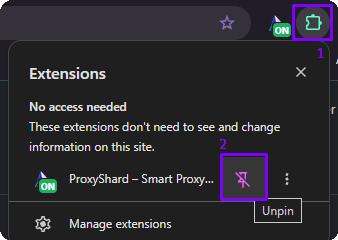
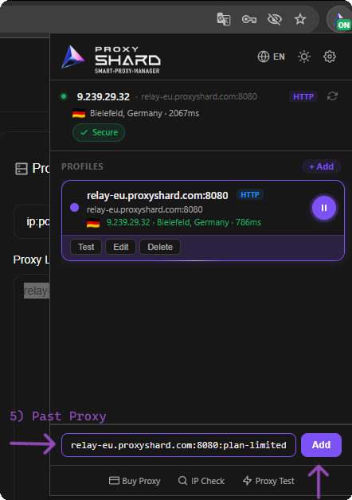
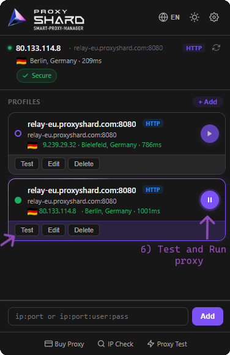
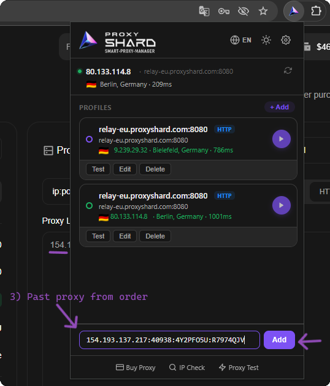
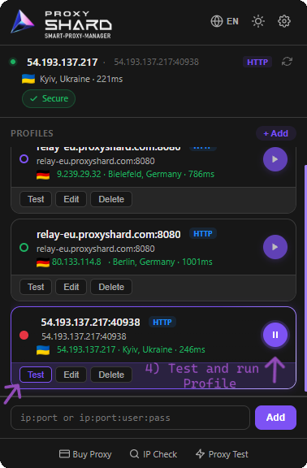
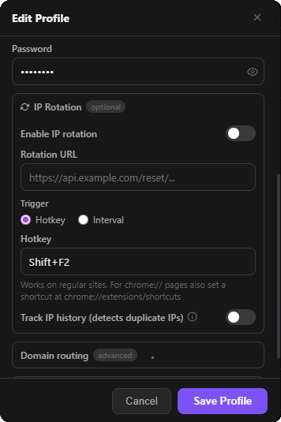
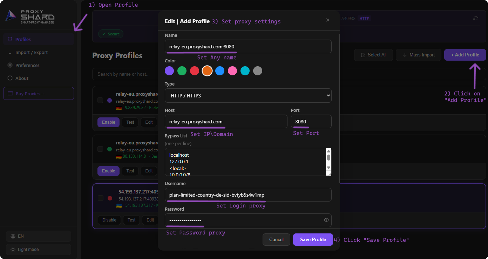

# ProxyShard Extension

<mark style="color:purple;">**ProxyShard – Smart Proxy Manager**</mark> is our official extension for <mark style="color:purple;">Chrome</mark>, <mark style="color:purple;">Mozilla Firefox</mark>, and other Chromium-based browsers (<mark style="color:purple;">Edge</mark>, <mark style="color:purple;">Opera</mark>, <mark style="color:purple;">Brave</mark>, <mark style="color:purple;">Yandex</mark>, and others). It lets you add, switch, and test proxies straight from your browser in just a couple of clicks, with no third-party software needed.

#### What the extension can do:

* Stores an unlimited number of proxy profiles
* Supports <mark style="color:purple;">HTTP / HTTPS</mark> connections in all supported browsers
* Supports <mark style="color:purple;">SOCKS5</mark> in the Mozilla Firefox version
* One-click profile testing (latency, country, IP)
* <mark style="color:purple;">**IP rotation on a timer or by hotkey**</mark> for mobile proxies
* Bypass lists and advanced domain routing
* Localized into **English, Russian, Ukrainian, and Chinese**

<figure><figcaption>
ProxyShard extension overview
</figcaption></figure>

## Installation

The extension is available in the official **Chrome Web Store** and **Firefox Add-ons**. The Chrome Web Store version also installs without issues in Edge, Opera, Brave, and other Chromium-based browsers.

### Chrome, Edge, Opera, Brave, Yandex, and other Chromium-based browsers

{% embed url="https://chromewebstore.google.com/detail/proxyshard-%E2%80%93-smart-proxy/ohlcikccaeapbfpmejhckfjjddkcflbe" %}

### Mozilla Firefox



Once installed, open the extensions menu (the puzzle icon next to the address bar) and **pin ProxyShard** for quick access by clicking the pin icon next to the extension's name.

<figure><figcaption>
1) Open the extensions menu 2) Pin ProxyShard
</figcaption></figure>


**SOCKS5 limitation in Chromium-based browsers**

Google Chrome (and other Chromium browsers) does not support login/password authentication over SOCKS5 proxies out of the box. For **Manifest V3** extensions, this limitation still applies.

You can use SOCKS5 through the extension only:

* **without credentials** (anonymous proxy), or
* **with IP whitelist binding**

For proxies that require authentication, use the <mark style="color:purple;">**HTTP / HTTPS**</mark> protocol, which is fully supported.



**SOCKS5 in Mozilla Firefox**

The Mozilla Firefox version of ProxyShard Extension supports SOCKS5 through the extension, so you can use SOCKS5 profiles directly in Firefox.


## Setting up Residential proxies

1. Open your order on the [**Residential proxy**](https://dashboard.proxyshard.com/en/residential-main) page and configure the proxy parameters (country, region, protocol, TTL, port, etc.).
2. Click <mark style="color:purple;">**Generate proxy**</mark>, and the generated proxy will appear in the <mark style="color:purple;">Proxy List</mark> block on the right.
3. Copy the connection string with the <mark style="color:purple;">**Copy all**</mark> button.
4. Open the ProxyShard extension (the pinned icon next to the address bar).

<figure><figcaption>
Steps 1-4: configuring and copying the proxy from the dashboard
</figcaption></figure>

5. In the field at the bottom of the extension, **paste the copied string** in the `ip:port:login:password` format and click <mark style="color:purple;">**Add**</mark>.

<figure><figcaption>
Step 5: pasting the proxy and adding the profile
</figcaption></figure>

6. The profile will appear in the list. Click <mark style="color:purple;">**Test**</mark> to verify it works, and the <mark style="color:purple;">**Play**</mark> button to activate the proxy.

<figure><figcaption>
Step 6: testing and starting the profile
</figcaption></figure>

## Setting up Datacenter / ISP proxies

1. Open your <mark style="color:purple;">Datacenter</mark> or <mark style="color:purple;">ISP proxy</mark> order on the dashboard and **copy** the connection string from the <mark style="color:purple;">Proxy List</mark> block.
2. Open the pinned **ProxyShard** extension.

<figure><figcaption>
Steps 1-2: copying the proxy from your order and opening the extension
</figcaption></figure>

3. In the field at the bottom of the extension, **paste the proxy** (`ip:port:login:password`) and click <mark style="color:purple;">**Add**</mark>.

<figure><figcaption>
Step 3: pasting the proxy into the extension
</figcaption></figure>

4. Click <mark style="color:purple;">**Test**</mark> to verify, then activate the profile with the <mark style="color:purple;">**Play**</mark> button.

<figure><figcaption>
Step 4: testing and starting the profile
</figcaption></figure>


**For Mobile proxies: IP rotation on a timer or by hotkey**

When editing a profile, an <mark style="color:purple;">**IP Rotation**</mark> block is available, which is especially useful for <mark style="color:purple;">mobile proxies</mark>:

* **Rotation URL** - paste the IP-change link from your mobile proxy order, and the extension will hit it automatically.
* **Trigger: Interval** - rotation will run at the time interval you set.
* **Trigger: Hotkey** - assign a key combination (for example, `Shift+F2`) to rotate the IP on the fly.
* **Track IP history** - duplicate-detection feature: the extension will notify you if the same IP address repeats during your session.



## Adding a profile manually

If you'd like to create a profile by hand instead of pasting a ready-made string, use the full <mark style="color:purple;">**+ Add Profile**</mark> form.

1. In the extension, open the <mark style="color:purple;">**Profiles**</mark> section (via the gear / settings icon).
2. Click the <mark style="color:purple;">**+ Add Profile**</mark> button in the top-right corner.
3. Fill in the profile parameters:
   * <mark style="color:purple;">**Name**</mark> - any profile name you like
   * <mark style="color:purple;">**Color**</mark> - a color tag for convenience
   * <mark style="color:purple;">**Type**</mark> - protocol (`HTTP / HTTPS` is recommended)
   * <mark style="color:purple;">**Host**</mark> and <mark style="color:purple;">**Port**</mark> - the proxy server address and port
   * <mark style="color:purple;">**Bypass List**</mark> - list of IPs / domains that should go **directly**, bypassing the proxy (one entry per line)
   * <mark style="color:purple;">**Username**</mark> / <mark style="color:purple;">**Password**</mark> - authentication details
4. Click <mark style="color:purple;">**Save Profile**</mark>.

<figure><figcaption>
The full profile creation form
</figcaption></figure>


**Done!** The ProxyShard extension is fully configured and ready to go. Switch between proxies in one click from any supported browser.

