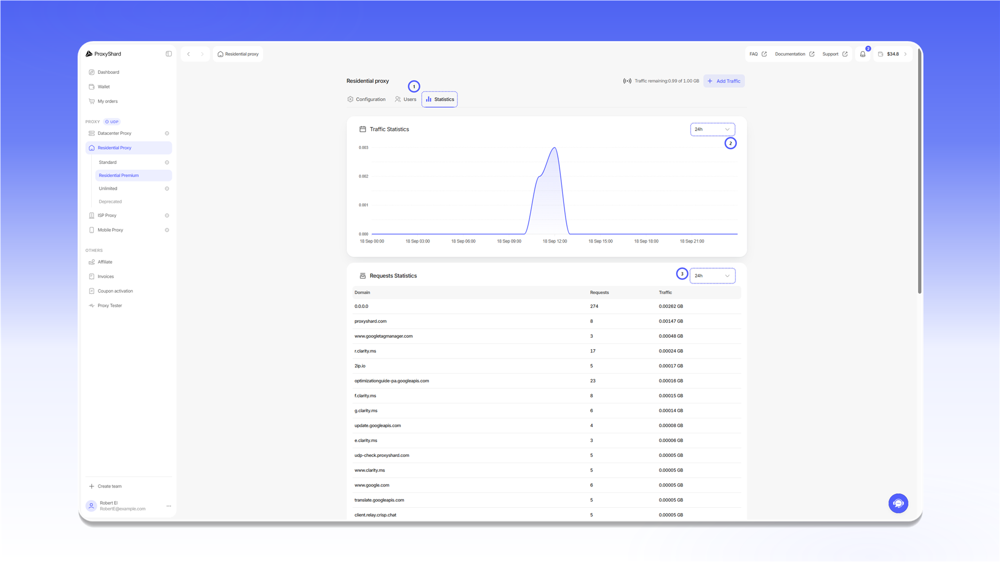

# Residential proxies

<mark style="color:purple;">Residential proxies</mark> are hosted on real home devices. They are ideal for working with many home-ISP IP addresses and support fine-grained targeting down to operator selection.\
You can review product restrictions [here](../restrictions.md).


Unused traffic does not expire at the end of the month. It remains on the order until it is fully used.



Addresses are issued on real home IPs. A session can change at any moment if the device in the pool leaves the traffic-sharing network. If you need a **static IP**, see [Datacenter](../datacenter-proxies.md) or [ISP proxies](../isp-proxies.md).




Step-by-step purchase and payment guide: [Purchasing residential proxies](../../site-navigation/buying-and-renewing/buying-residential-proxies.md).

## Plans

| Parameter            | [Standard](standard-residential.md) | [Unlimited](unlimited-residential-proxy.md) | [Premium](premium-residential.md) |
| -------------------- | ------------------------------------ | ------------------------------------------- | --------------------------------- |
| Pool size            | 300k - 400k                          | 300k - 400k (= Standard)                    | 3.8M - 4.6M                       |
| Max connections      | 35,000                               | 5,000                                       | -                                 |
| Max speed            | 75 Mbps                              | 75 Mbps                                     | 75 Mbps                           |
| [UDP support](../about-udp/) | ✓ (except USA; port restrictions apply) | ✓ (except USA; port restrictions apply) | ✓ (except some cities and macOS/iOS devices) |
| [Device OS filtering](../p0f-spoofing.md) | ✗ | ✗ | ✓ |
| Unlimited plan       | ✗                                    | ✓                                           | ✗                                 |
| Billing              | Per GB (Pay as you go)               | Day / Half-month / Month                    | Per GB (Pay as you go)            |
| Price                | **$2 / GB**                          | **$30** / day · **$399** / half-month · **$699** / month | **$3 / GB**          |

## Available countries

### Standard and Unlimited Residential

**165 countries** and the `Random` option for automatic country selection are available.


[available-countries.md](available-countries.md)


### Premium Residential

**214 countries** are available.


[premium-available-countries.md](premium-available-countries.md)


## How to purchase

1. Under `Residential Proxy`, select `Standard`, `Residential Premium`, or `Unlimited`.
2. For a traffic-based plan, enter the number of gigabytes.
3. If you have a promo code, enter it in `Promocode` and click `Apply`.
4. Check the total and click `Buy now`.

<figure>
  <picture>
    <source srcset="../../.gitbook/assets/residential-purchase-form_black.png" media="(prefers-color-scheme: dark)">
    
  </picture>
</figure>

Payment and adding traffic are covered in [Purchasing residential proxies](../../site-navigation/buying-and-renewing/buying-residential-proxies.md).

## Proxy configuration

For a basic connection, select `Country` and click `Generate proxy`. Use the other fields only when you need more precise targeting or session control.

<figure>
  <picture>
    <source srcset="../../.gitbook/assets/residential-settings_black.png" media="(prefers-color-scheme: dark)">
    
  </picture>
</figure>

1. `Country` selects the country.
2. `Region` selects a region within the country.
3. `City` selects the city.
4. `ISP` filters addresses by provider. This field is available only for [Premium Residential](premium-residential.md).
5. `Session` controls rotation. `Sticky` keeps one IP for the configured `TTL`, while `Rotate` changes the IP on every request.
6. `Protocol` selects `HTTP` or `SOCKS5`.
7. `Relay` changes the connection server. Use it only if you have connection issues.
8. `TTL` sets the IP lifetime for a `Sticky` session. The minimum value is 60 seconds.
9. `Device OS` filters the [Premium Residential](premium-residential.md) pool by the operating system of the device.
10. `Amount` sets the number of connection strings generated at once.
11. `Session mode` controls Premium Residential sessions. `Default(after 5sec)` switches sessions if a device does not respond for more than five seconds. `Static` waits for the same device to return for the configured `TTL`.
12. `Generate proxy` creates connection strings with the selected settings.
13. `Proxy List` displays the generated strings. Use `Format` to change their format and `Copy all` to copy the complete list.

`Presets` stores reusable sets of settings. Configure the fields, click `Save preset`, and select the saved preset the next time you generate proxies.


Combining `Device OS` with city and provider targeting can reduce the available pool considerably. Suitable macOS or iOS devices may not be available in Tier 2 and Tier 3 countries.



With a non-default `Session mode`, a connection string may stop responding when the selected device leaves the network. Generate a new string with `Generate proxy` if this happens.



`Regenerate password` changes the order password and immediately invalidates every previously generated string. Use it only if the credentials may have been exposed. To track traffic by user, use the `Users` tab.


`Proxy List` is a dynamic field, not storage. Previously generated strings remain valid because the selected parameters are encoded in `Username`. Use `Presets` to save the settings themselves.

## Connection string format

The standard format is:

```text
host:port:username:password
```

* `host` specifies the connection server, for example `relay-eu.proxyshard.com`.
* `port` connects to that server and does not determine the final IP by itself.
* `username` contains the targeting parameters and the `sid` session identifier.
* `password` is used for authentication.

You can add the complete string to a browser, application, or another client. Step-by-step examples are available in the [setup guides](../../setup-guides/getting-started.md).

## Statistics

<figure>
  <picture>
    <source srcset="../../.gitbook/assets/residential-statistics_black.png" media="(prefers-color-scheme: dark)">
    
  </picture>
</figure>

1. Open the `Statistics` tab.
2. Select the period for `Traffic Statistics`.
3. Select the period for `Requests Statistics` separately.

New data may take 10-20 minutes to appear. Statistics are retained for one month.

## What tasks they fit

Social media and multi-accounting, crypto exchanges (Binance, Bybit and others), Polymarket, web scraping, SEO monitoring, ad verification, e-commerce analytics, price monitoring, geo-targeted website testing.

## Pros and cons of Residential proxies

#### <mark style="color:green;">Pros:</mark>

* **Flexible billing** - Pay as you go or an unlimited subscription (Unlimited)
* **IP rotation** - change addresses on demand or by timer (TTL)
* **Wide geo-targeting** - select country, region, city and operator
* **Home-origin addresses** - IPs are registered to home ISPs
* **UDP support** - available on Standard, Unlimited and Premium subject to product restrictions

#### <mark style="color:red;">Cons:</mark>

* **Possible speed drops** - performance depends on the end device's internet connection; this is inherent to this proxy type
* **Dynamic IP** - the address may change at any moment; if you need a static IP, see [ISP](../isp-proxies.md) or [Datacenter](../datacenter-proxies.md)
* **p0f spoofing is unavailable** - Premium Residential offers only [Device OS filtering](../p0f-spoofing.md)
* **UDP restrictions** - Standard and Unlimited do not support UDP in the USA; Premium has exceptions for certain cities and macOS/iOS devices. General [port restrictions](../restrictions.md) also apply


Need a static address with UDP? Choose [ISP proxies](../isp-proxies.md).



See the [setup guides](../../setup-guides/getting-started.md) for proxy configuration instructions.

