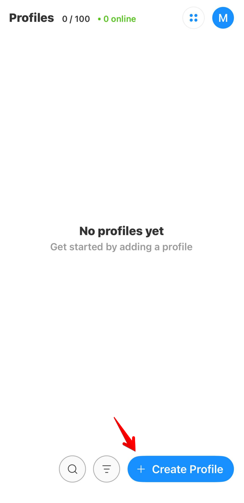

# Octo Browser for iOS


The proxy applies only to the active Octo Browser profile. Other apps on the device continue using their regular Internet connection.


## Install Octo Browser

Download Octo Browser from the App Store.



## Create an account and sign in

Create an account with your email address or tap **Sign up with Apple**.

<figure><figcaption></figcaption></figure>

After registration, sign in using the same method.

## Create a profile with a proxy

On the **Profiles** screen, tap **Create Profile**.

<figure><figcaption></figcaption></figure>

In the new profile settings, tap **Set a proxy**.

<figure><figcaption></figcaption></figure>

Copy the proxy connection string from your ProxyShard order and paste the entire string into the **Proxy** field. Octo Browser supports HTTP, HTTPS, and SOCKS5 proxies.

Tap **Check proxy**. After a successful check, the app displays the connection IP address, location, and time zone. Tap **Done** to continue.

<figure><figcaption></figcaption></figure>

## Start the profile

Tap **Create & Start** to save and immediately launch the profile.

<figure><figcaption></figcaption></figure>

The profile is ready. Its traffic will now be routed through the added proxy.
