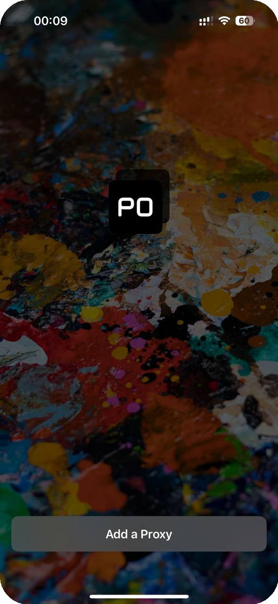
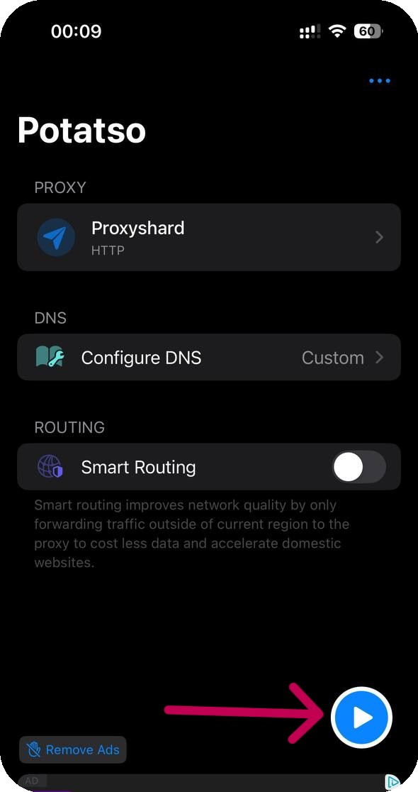

# Potatso

## Installing Potatso

Download the application.



## Potatso setup

Then open the application and add the proxy.

<figure><figcaption></figcaption></figure>

Create a new configuration.

<figure><figcaption></figcaption></figure>

## Profile setup

Enter your proxies from the order and select the connection type.

<figure><figcaption></figcaption></figure>


**You can find a proxy setup example in the [Setup guide](../getting-started.md) section**


Save the settings and start the program.

<figure><figcaption></figcaption></figure>

**Done! You have finished setting up the proxy through the "Potatso" application.**\
**You can now start using our proxies.**
