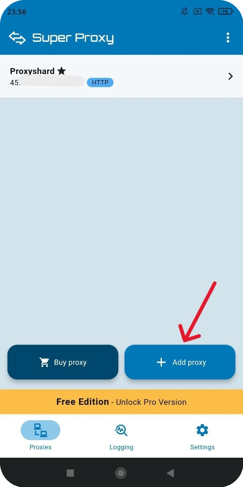

# Super Proxy

## Super Proxy setup

Download the application through the link:



## Creating a profile

Then open the application and add the proxy through "<mark style="color:purple;">Add proxy</mark>".

<figure><figcaption></figcaption></figure>

Enter the proxy from the order into the corresponding fields and specify the connection protocol type.

<figure><figcaption></figcaption></figure>


**You can find a proxy setup example in the [Setup guide](../getting-started.md) section**


Save the settings and start the program.

<figure><figcaption></figcaption></figure>

**Done! You have finished setting up the proxy through the "Super Proxy" application.**\
**You can now start using our proxies.**

