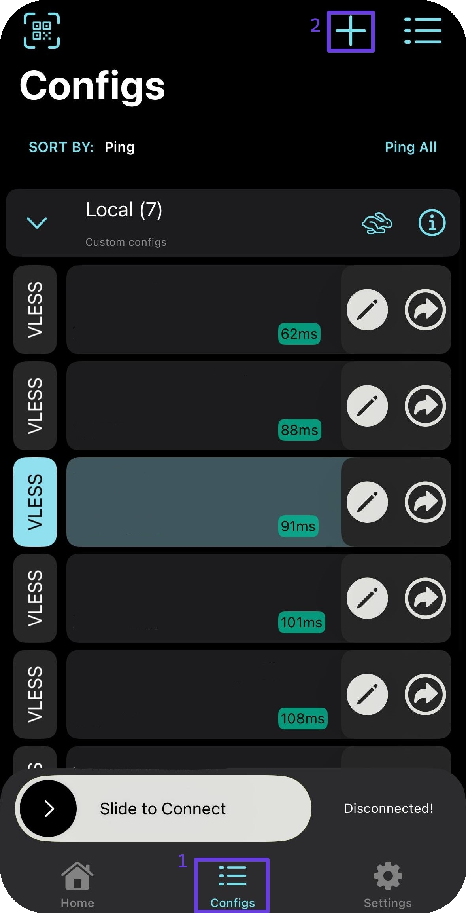
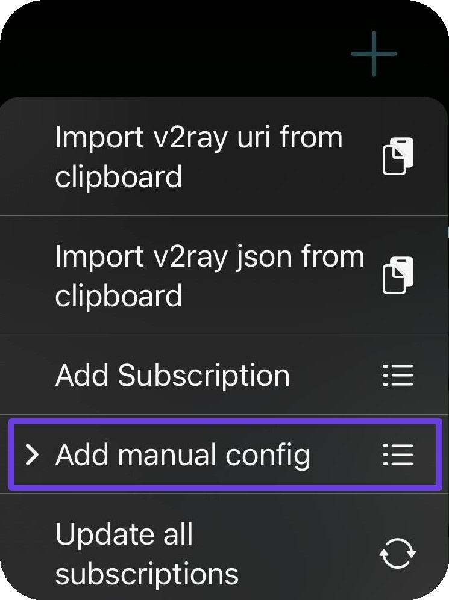
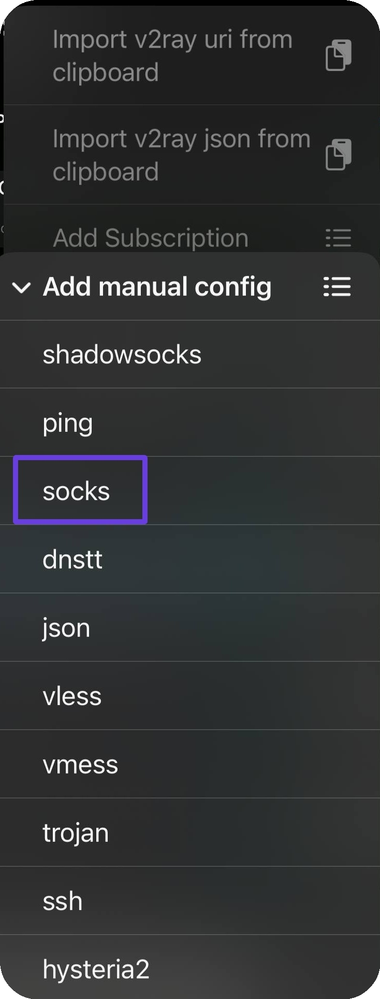
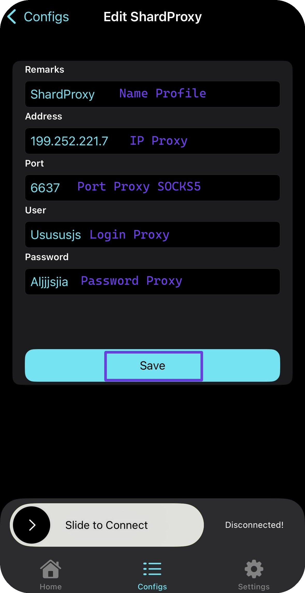

# 🔥 V2Box


This solution supports UDP tunneling!


## Installing V2Box

Go to the App Store/Google Play and download the V2BOX application.

#### <mark style="color:green;">Android</mark>



#### <mark style="color:blue;">**iOS**</mark>



## V2Box setup

Open the application, go to the "<mark style="color:purple;">Configs</mark>" tab, and create a new configuration with "➕".

<figure><figcaption></figcaption></figure>

<figure><figcaption></figcaption></figure>

Specify the <mark style="color:purple;">SOCKS</mark> connection type.

<figure><figcaption></figcaption></figure>

Enter your proxies from the order into the program fields.

<figure><figcaption></figcaption></figure>


**You can find a proxy setup example in the [Setup guide](../getting-started.md) section**


Save your configuration and go back to "<mark style="color:purple;">Configs</mark>". There you must click your config to connect. 

<figure><figcaption></figcaption></figure>

\
**Done! You can now check the proxy with our** [**checker**](https://proxyshard.com/proxy-tester)
