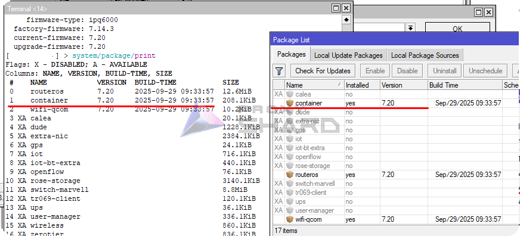
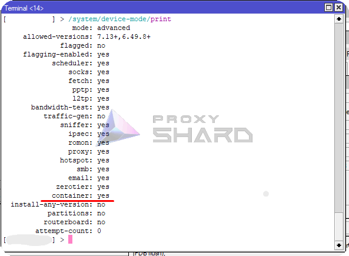
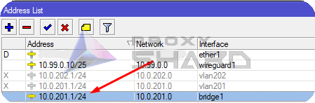
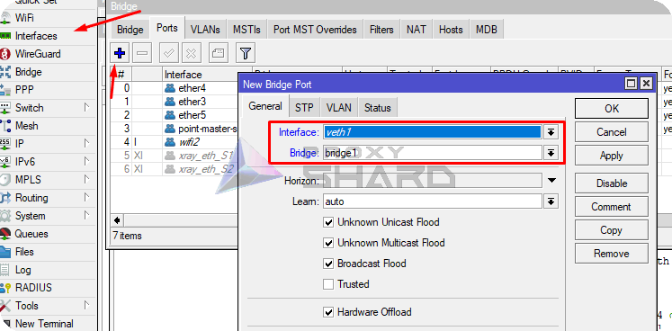
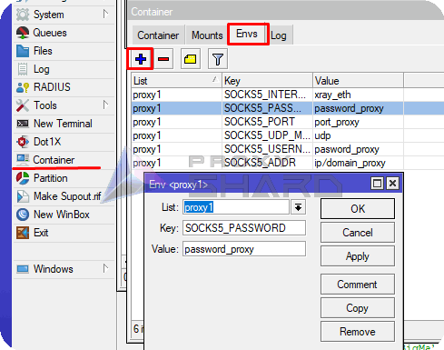
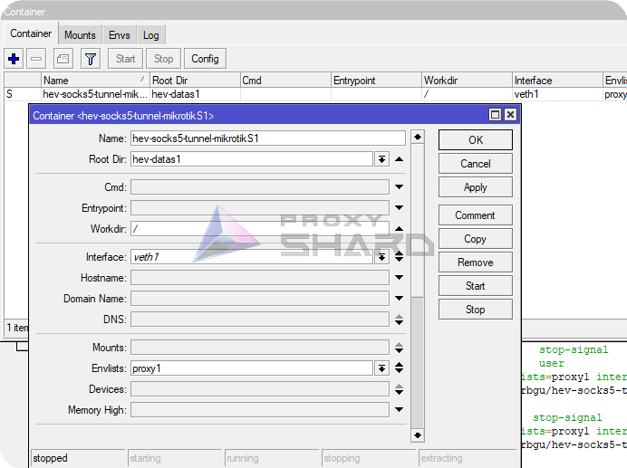
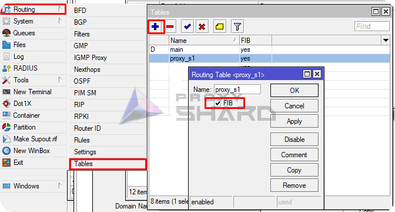
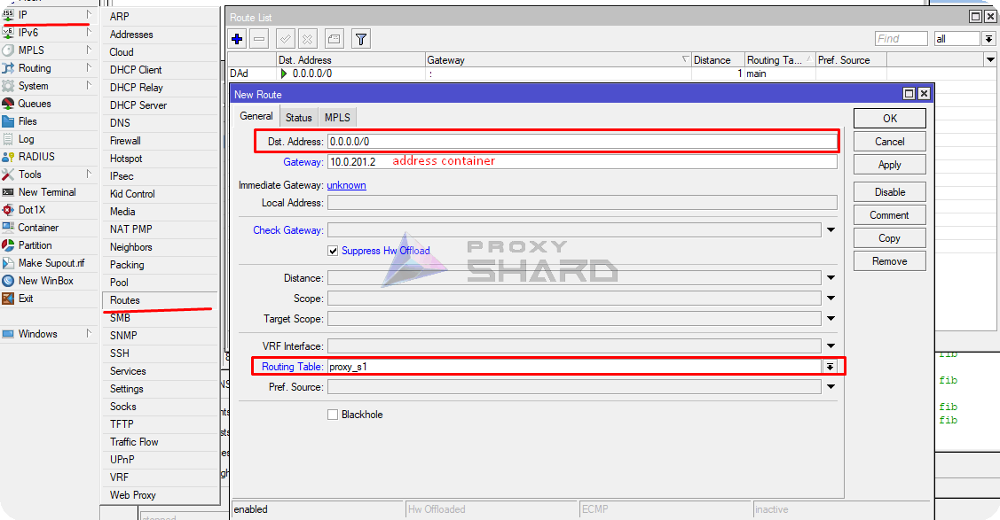
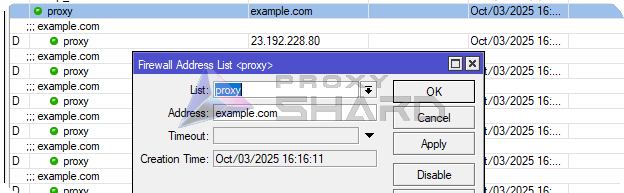
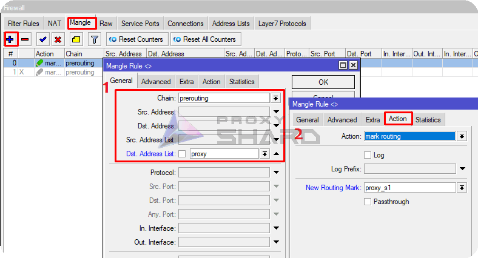

# MikroTik proxy

## System requirements

To use proxies on <mark style="color:blue;">MikroTik</mark> routers, consider the following hardware requirements:\
\
1\) <mark style="color:$danger;">RouterOS version 7 or higher</mark>, because containerization support is required\
\
2\) Router models with more than <mark style="color:$danger;">128 MB RAM</mark>\
\
3\) The router must have a [**arm64**, **arm**, or **x86**](https://mikrotik.com/products/matrix) CPU architecture, because virtualization is supported only on these architectures. Learn more at the link:

[https://help.mikrotik.com/docs/spaces/ROS/pages/84901929/Container](https://help.mikrotik.com/docs/spaces/ROS/pages/84901929/Container)


Examples of suitable routers currently available on the market: **hAP ax2, hAP ax3, Chateau PRO ax, RB5009,L009UiGS**



#### Warning:

You need physical access to your RouterOS device to enable support for the container feature, it is disabled by default;

* once the container feature is enabled, containers can be added/configured/started/stopped/removed remotely!
* if your RouterOS device is compromised, containers can be used to easily install malicious software in your RouterOS device and over network;
* your RouterOS device is as secure as anything you run in container;
* if you run container, there is no security guarantee of any kind;
* running a 3rd party container image on your RouterOS device could open a security hole/attack vector/attack surface;
* an expert with knowledge how to build exploits will be able to jailbreak/elevate to root;

[https://help.mikrotik.com/docs/spaces/ROS/pages/84901929/Container#Container-Disclaimer](https://help.mikrotik.com/docs/spaces/ROS/pages/84901929/Container#Container-Disclaimer)


## **Preparing the router**

1. **Installing the required package**

Open the console and enter the following commands to set the update channel.

```sh
/system package update set channel=stable
```

Then print the package list.

```sh
/system package update check-for-updates
```

Enable the "container" package and reboot the router.

```sh
/system/package enable container
```

\
Or manually install the 'Container' package through Winbox, after downloading "Extra packages" for your <mark style="color:$danger;">**ROS**</mark> version and <mark style="color:$danger;">**architecture**</mark> from the MikroTik website ([https://mikrotik.com/download](https://mikrotik.com/download)).

<figure><figcaption></figcaption></figure>

Open the downloaded archive, copy the package to File List, and reboot the device.

<figure><figcaption></figcaption></figure>

After rebooting, the "Container" package should appear.

<figure><figcaption></figcaption></figure>

2. **Enabling containerization support**

To activate containerization on the router, enter the following command in the terminal:

```sh
/system/device-mode/update container=yes
```

Then reboot the router within 5 minutes. After rebooting, container creation will become available .png>)

You can also check this through the console:

```shell
/system/device-mode/print
```

"Container" should be "yes"

<figure><figcaption></figcaption></figure>

## **Installing and configuring the container**

**Creating a VETH interface**

Create a virtual interface for the future container:

```bash
/interface veth add address=10.0.201.2/24 dhcp=no gateway=10.0.201.1 gateway6="" mac-address=6D:F3:B2:85:44:45 name=veth1
```

Where:\
_**address**_ - the address you want to assign to the container\
_**gateway**_ - the address of your bridge (main network gateway)

<figure><figcaption><p>Viewing the bridge address</p></figcaption></figure>

For clarity, we will perform all actions inside the internal network, without separating the container network from the home network.

2. **Adding the interface to the active bridge**

Add the created interface to the bridge.

```sh
/interface bridge port
 add bridge=bridge1 interface=veth1
```

<figure><figcaption></figcaption></figure>

3. **Configuring virtualization and adding the container**

In this example, we will use a Docker image from [wiktorbgu](https://github.com/wiktorbgu) based on [hev-socks5-tunnel](https://github.com/heiher/hev-socks5-tunnel).

[Link](https://hub.docker.com/r/wiktorbgu/hev-socks5-tunnel-mikrotik) to the Docker image

**Create variables for the container**

For the container, you need to create variables that include the proxy connection parameters. To do this, add the following variables in the MikroTik console:

```bash
/container envs 
add key=SOCKS5_ADDR list=proxy1 value=ip/domain_proxy 
add key=SOCKS5_INTERFACE list=proxy1 value=xray_eth 
add key=SOCKS5_PASSWORD list=proxy1 value=password_proxy 
add key=SOCKS5_PORT list=proxy1 value=port_proxy 
add key=SOCKS5_UDP_MODE list=proxy1 value=udp 
add key=SOCKS5_USERNAME list=proxy1 value=username_proxy
```

<figure><figcaption></figcaption></figure>

These fields must be filled in according to the data from the purchased order.


**You can find a proxy setup example in the [Setup guide](getting-started.md) section**



Please note that the test connection is made through SOCKS5! To find the SOCKS connection port, click _**Show socks5**_ inside the order.


## **Adding the container**

Add registry-url and a temporary folder for downloading images.

```bash
/container config
set registry-url=https://registry-1.docker.io tmpdir=/tmp
```

Then create the container, specifying "work dir", "interface", and other parameters.

```bash
/container
add check-certificate=no envlists=proxy1 interface=veth1 name=hev-socks5-tunnel-mikrotikS1 remote-image=wiktorbgu/hev-socks5-tunnel-mikrotik root-dir=hev-datas1 workdir=/ start-on-boot=yes
```

<figure><figcaption></figcaption></figure>

Start the container.

```bash
/container/start hev-socks5-tunnel-mikrotikS1
```

.png>)

At this stage, it is also worth checking connectivity with the container.

```bash
ping 10.0.201.2
```

## Custom routing setup

1. **Adding routes**

To configure precise routing for individual network devices or traffic to specific resources, you need to create a separate FIB.

```bash
/routing/table/add name=proxy_s1 fib
```

<figure><figcaption></figcaption></figure>

Add a default route to the container for future rules.

```bash
/ip route
add disabled=no dst-address=0.0.0.0/0 gateway=10.0.201.2 routing-table=
proxy_s1 suppress-hw-offload=yes
```

<figure><figcaption></figcaption></figure>

2. **Adding rules to redirect traffic to specific resources**

To add traffic redirection to the required resource through a proxy, create a static address list in "ip/firewall/address list".

Suppose we want to open example.com through a proxy. Create a list with any name and specify the resource IP address or domain.

```bash
/ip firewall address-list
add address=example.com list=proxy
```

<figure><figcaption></figcaption></figure>

Next, create a Mangle rule that marks all traffic to the specified resource, and in "Action" specify the new route path created in the previous step.

```bash
/ip firewall mangle
add action=mark-routing chain=prerouting dst-address-list=proxy new-routing-mark=proxy_s1 passthrough=no
```

<figure><figcaption></figcaption></figure>

Using the same logic, you can add other resources, for example YouTube:

<details>

<summary>List for YouTube</summary>

add address=142.250.184.0/24 comment=Youtube list=proxy\
add address=107.0.0.0/8 comment=Youtube list=proxy\
add address=142.250.185.0/24 comment=Youtube list=proxy\
add address=3.0.0.0/8 comment=Youtube list=proxy\
add address=216.58.212.0/24 comment=Youtube list=proxy\
add address=93.158.134.0/24 comment=Youtube list=proxy\
add address=74.125.71.0/24 comment=Youtube list=proxy\
add address=216.58.206.0/24 comment=Youtube list=proxy\
add address=142.250.186.0/24 comment=Youtube list=proxy\
add address=42.192.32.0/24 comment=Youtube list=proxy\
add address=74.125.206.0/24 comment=Youtube list=proxy\
add address=173.194.0.0/16 comment=Youtube list=proxy\
add address=172.217.0.0/16 comment=Youtube list=proxy\
add address=142.250.0.0/16 comment=Youtube list=proxy\
add address=74.125.0.0/16 comment=Youtube list=proxy\
add address=216.58.0.0/16 comment=Youtube list=proxy\
add address=74.0.0.0/8 comment=Youtube list=proxy\
add address=3.76.0.0/16 comment=Youtube list=proxy\
add address=3.78.0.0/16 comment=Youtube list=proxy\
add address=216.239.0.0/16 comment=Youtube list=proxy\
add address=64.233.0.0/16 comment=Youtube list=proxy\
add address=8.222.0.0/16 comment=Youtube list=proxy\
add address=107.155.0.0/16 comment=Youtube list=proxy\
add address=35.207.0.0/16 comment=Youtube list=proxy\
add address=3.66.0.0/16 comment=Youtube list=proxy\
add address=18.140.0.0/16 comment=Youtube list=proxy\
add address=23.2.0.0/16 comment=Youtube list=proxy\
add address=99.81.0.0/16 comment=Youtube list=proxy\
add address=54.0.0.0/16 comment=Youtube list=proxy\
add address=77.241.0.0/16 comment=Youtube list=proxy\
add address=108.177.0.0/16 comment=Youtube list=proxy\
add address=184.86.0.0/16 comment=Youtube list=proxy\
add address=52.0.0.0/16 comment=Youtube list=proxy\
add address=63.35.0.0/16 comment=Youtube list=proxy\
add address=101.34.0.0/16 comment=Youtube list=proxy\
add address=34.252.0.0/16 comment=Youtube list=proxy\
add address=45.57.0.0/16 comment=Youtube list=proxy\
add address=169.254.0.0/16 comment=Youtube list=proxy\
add address=34.0.0.0/16 comment=Youtube list=proxy\
add address=184.0.0.0/16 comment=Youtube list=proxy\
add address=87.0.0.0/16 comment=Youtube list=proxy\
add address=213.59.0.0/16 comment=Youtube list=proxy\
add address=157.240.247.174 comment=Instagram list=proxy\
add address=46.53.178.107 comment=Instagram list=proxy\
add address=179.60.195.174 comment=Instagram list=proxy\
add address=157.240.205.174 comment=Instagram list=proxy\
add address=31.13.24.0/21 comment=Instagram list=proxy\
add address=31.13.64.0/18 comment=Instagram list=proxy\
add address=45.64.40.0/22 comment=Instagram list=proxy\
add address=66.220.144.0/20 comment=Instagram list=proxy\
add address=69.63.176.0/20 comment=Instagram list=proxy\
add address=69.171.224.0/19 comment=Instagram list=proxy\
add address=74.119.76.0/22 comment=Instagram list=proxy\
add address=103.4.96.0/22 comment=Instagram list=proxy\
add address=129.134.0.0/16 comment=Instagram list=proxy\
add address=157.240.0.0/16 comment=Instagram list=proxy\
add address=173.252.64.0/18 comment=Instagram list=proxy\
add address=179.60.192.0/22 comment=Instagram list=proxy\
add address=185.60.216.0/22 comment=Instagram list=proxy\
add address=204.15.20.0/22 comment=Instagram list=proxy\
add address=157.240.200.63 comment=Instagram list=proxy\
add address=185.60.219.63 comment=Instagram list=proxy\
add address=129.134.31.12 comment=Instagram list=proxy\
add address=66.81.203.132 comment=Instagram list=proxy\
add address=185.89.218.12 comment=Instagram list=proxy\
add address=31.13.66.63 comment=Instagram list=proxy\
add address=84.15.65.162 comment=Instagram list=proxy\
add address=68.66.224.28 comment=Instagram list=proxy\
add address=157.240.253.63 comment=Instagram list=proxy\
add address=83.174.11.224 comment=Instagram list=proxy\
add address=157.240.9.52 comment=Instagram list=proxy\
add address=157.240.252.174 comment=Instagram list=proxy\
add address=157.240.195.63 comment=Instagram list=proxy\
add address=31.13.71.52 comment=Instagram list=proxy\
add address=57.144.110.192 comment=Instagram list=proxy\
add address=157.240.252.17 comment=Instagram list=proxy\
add address=84.15.66.97 comment=Instagram list=proxy\
add address=217.168.6.33 comment=Instagram list=proxy\
add address=31.13.83.52 comment=Instagram list=proxy\
add address=157.240.241.63 comment=Instagram list=proxy\
add address=129.134.30.12 comment=Instagram list=proxy\
add address=185.89.219.12 comment=Instagram list=proxy\
add address=157.240.252.10 comment=Instagram list=proxy\
add address=157.240.201.63 comment=Instagram list=proxy\
add address=66.81.203.197 comment=Instagram list=proxy\
add address=179.60.195.52 comment=Instagram list=proxy\
add address=66.81.203.7 comment=Instagram list=proxy\
add address=216.40.34.41 comment=Instagram list=proxy\
add address=157.240.202.63 comment=Instagram list=proxy\
add address=157.240.229.63 comment=Instagram list=proxy\
add address=157.240.252.63 comment=Instagram list=proxy\
add address=31.13.72.53 comment=Instagram list=proxy\
add address=124.108.16.224 comment=Instagram list=proxy\
add address=157.240.205.63 comment=Instagram list=proxy\
add address=92.46.37.96 comment=Instagram list=proxy\
add address=157.240.247.63 comment=Instagram list=proxy\
add address=157.240.234.63 comment=Instagram list=proxy\
add address=157.240.235.63 comment=Instagram list=proxy\
add address=87.245.208.97 comment=Instagram list=proxy\
add address=216.58.192.0/19 comment=Instagram list=proxy\
add address=209.85.128.0/17 comment=Instagram list=proxy\
add address=198.105.240.0/20 comment=Instagram list=proxy\
add address=142.250.0.0/15 comment=Instagram list=proxy\
add address=108.177.0.0/17 comment=Instagram list=proxy\
add address=87.245.197.140 comment=Instagram list=proxy\
add address=64.233.160.0/19 comment=Instagram list=proxy\
add address=157.240.0.1 comment=Instagram list=proxy\
add address=157.240.238.63 comment=Instagram list=proxy\
add address=157.240.238.174 comment=Instagram list=proxy\
add address=157.240.0.63 comment=Instagram list=proxy\
add address=157.240.224.63 comment=Instagram list=proxy\
add address=157.240.224.174 comment=Instagram list=proxy\
add address=157.240.251.36 comment=Instagram list=proxy\
add address=157.240.253.12 comment=Instagram list=proxy\
add address=157.240.253.35 comment=Instagram list=proxy\
add address=157.240.238.13 comment=Instagram list=proxy\
add address=157.240.238.56 comment=Instagram list=proxy\
add address=157.240.238.175 comment=Instagram list=proxy\
add address=57.144.112.141 comment=Instagram list=proxy\
add address=157.240.251.60 comment=Instagram list=proxy\
add address=157.240.251.128 comment=Instagram list=proxy\
add address=157.240.238.5 comment=Instagram list=proxy\
add address=157.240.253.13 comment=Instagram list=proxy\
add address=157.240.253.5 comment=Instagram list=proxy\
add address=157.240.238.2 comment=Instagram list=proxy\
add address=157.240.238.37 comment=Instagram list=proxy\
add address=157.240.251.5 comment=Instagram list=proxy\
add address=157.240.251.34 comment=Instagram list=proxy\
add address=57.144.112.1 comment=Instagram list=proxy\
add address=157.240.238.54 comment=Instagram list=proxy\
add address=129.134.26.123 comment=Instagram list=proxy\
add address=157.240.252.3 comment=Instagram list=proxy\
add address=31.13.84.4 comment=Instagram list=proxy\
add address=157.240.224.12 comment=Instagram list=proxy\
add address=157.240.238.4 comment=Instagram list=proxy\
add address=157.240.0.13 comment=Instagram list=proxy\
add address=3.33.139.32 comment=Instagram list=proxy\
add address=157.240.0.35 comment=Instagram list=proxy\
add address=157.240.238.14 comment=Instagram list=proxy\
add address=157.240.238.60 comment=Instagram list=proxy\
add address=57.144.112.145 comment=Instagram list=proxy\
add address=157.240.251.35 comment=Instagram list=proxy\
add address=157.240.0.21 comment=Instagram list=proxy\
add address=54.155.178.5 comment=Netflix list=proxy\
add address=3.251.50.149 comment=Netflix list=proxy\
add address=54.74.73.31 comment=Netflix list=proxy\
add address=52.1.147.205 comment=Netflix list=proxy\
add address=107.20.175.192 comment=Netflix list=proxy\
add address=50.17.247.9 comment=Netflix list=proxy\
add address=204.236.236.127 comment=Netflix list=proxy\
add address=52.6.46.142 comment=Netflix list=proxy\
add address=18.236.7.30 comment=Netflix list=proxy\
add address=52.4.175.111 comment=Netflix list=proxy\
add address=100.82.106.206 comment=Netflix list=proxy\
add address=100.85.59.120 comment=Netflix list=proxy\
add address=46.137.171.215 comment=Netflix list=proxy\
add address=34.218.19.240 comment=Netflix list=proxy\
add address=44.226.113.145 comment=Netflix list=proxy\
add address=52.1.119.170 comment=Netflix list=proxy\
add address=52.214.181.141 comment=Netflix list=proxy\
add address=207.45.72.215 comment=Netflix list=proxy\
add address=100.82.180.182 comment=Netflix list=proxy\
add address=54.246.79.9 comment=Netflix list=proxy\
add address=52.4.38.70 comment=Netflix list=proxy\
add address=52.4.225.124 comment=Netflix list=proxy\
add address=52.4.240.221 comment=Netflix list=proxy\
add address=52.1.173.203 comment=Netflix list=proxy\
add address=52.0.16.118 comment=Netflix list=proxy\
add address=52.6.3.192 comment=Netflix list=proxy\
add address=34.252.74.1 comment=Netflix list=proxy\
add address=52.4.145.119 comment=Netflix list=proxy\
add address=52.5.181.79 comment=Netflix list=proxy\
add address=54.170.196.176 comment=Netflix list=proxy\
add address=52.31.48.193 comment=Netflix list=proxy\
add address=23.246.0.0/18 comment=Netflix list=proxy\
add address=37.77.184.0/21 comment=Netflix list=proxy\
add address=45.57.0.0/17 comment=Netflix list=proxy\
add address=64.120.128.0/17 comment=Netflix list=proxy\
add address=66.197.128.0/17 comment=Netflix list=proxy\
add address=108.175.32.0/20 comment=Netflix list=proxy\
add address=185.2.220.0/22 comment=Netflix list=proxy\
add address=185.9.188.0/22 comment=Netflix list=proxy\
add address=192.173.64.0/18 comment=Netflix list=proxy\
add address=198.38.96.0/19 comment=Netflix list=proxy\
add address=198.45.48.0/20 comment=Netflix list=proxy\
add address=198.45.56.0/21 comment=Netflix list=proxy\
add address=208.75.76.0/22 comment=Netflix list=proxy\
add address=209.237.204.128 comment=Twitter list=proxy\
add address=3.64.163.50 comment=Twitter list=proxy\
add address=104.244.42.2 comment=Twitter list=proxy\
add address=209.237.197.128 comment=Twitter list=proxy\
add address=188.40.44.177 comment=Twitter list=proxy\
add address=34.254.1.203 comment=Twitter list=proxy\
add address=108.186.36.25 comment=Twitter list=proxy\
add address=69.195.160.128 comment=Twitter list=proxy\
add address=69.195.176.128 comment=Twitter list=proxy\
add address=23.1.99.237 comment=Twitter list=proxy\
add address=93.184.220.70 comment=Twitter list=proxy\
add address=34.251.129.198 comment=Twitter list=proxy\
add address=209.237.196.128 comment=Twitter list=proxy\
add address=172.67.70.184 comment=Twitter list=proxy\
add address=104.26.0.84 comment=Twitter list=proxy\
add address=104.244.42.84 comment=Twitter list=proxy\
add address=151.101.0.159 comment=Twitter list=proxy\
add address=209.237.192.128 comment=Twitter list=proxy\
add address=104.26.1.84 comment=Twitter list=proxy\
add address=199.232.188.159 comment=Twitter list=proxy\
add address=3.248.100.228 comment=Twitter list=proxy\
add address=104.244.45.3 comment=Twitter list=proxy\
add address=104.244.42.193 comment=Twitter list=proxy\
add address=104.244.42.129 comment=Twitter list=proxy\
add address=69.195.177.128 comment=Twitter list=proxy\
add address=151.101.64.159 comment=Twitter list=proxy\
add address=209.237.194.128 comment=Twitter list=proxy\
add address=104.26.5.149 comment=Twitter list=proxy\
add address=104.244.42.196 comment=Twitter list=proxy\
add address=104.244.42.194 comment=Twitter list=proxy\
add address=23.1.106.237 comment=Twitter list=proxy\
add address=185.199.110.153 comment=Twitter list=proxy\
add address=209.237.199.128 comment=Twitter list=proxy\
add address=69.195.180.128 comment=Twitter list=proxy\
add address=151.101.192.159 comment=Twitter list=proxy\
add address=209.237.203.128 comment=Twitter list=proxy\
add address=209.237.193.128 comment=Twitter list=proxy\
add address=69.195.182.128 comment=Twitter list=proxy\
add address=104.244.42.67 comment=Twitter list=proxy\
add address=52.30.155.196 comment=Twitter list=proxy\
add address=52.214.101.56 comment=Twitter list=proxy\
add address=69.195.165.128 comment=Twitter list=proxy\
add address=104.244.42.148 comment=Twitter list=proxy\
add address=104.244.42.195 comment=Twitter list=proxy\
add address=104.244.42.66 comment=Twitter list=proxy\
add address=104.244.42.1 comment=Twitter list=proxy\
add address=185.199.111.153 comment=Twitter list=proxy\
add address=69.195.187.128 comment=Twitter list=proxy\
add address=104.244.42.130 comment=Twitter list=proxy\
add address=104.244.42.3 comment=Twitter list=proxy\
add address=185.199.108.153 comment=Twitter list=proxy\
add address=104.244.42.4 comment=Twitter list=proxy\
add address=69.195.168.128 comment=Twitter list=proxy\
add address=209.237.200.128 comment=Twitter list=proxy\
add address=209.237.201.128 comment=Twitter list=proxy\
add address=104.244.42.68 comment=Twitter list=proxy\
add address=69.195.186.128 comment=Twitter list=proxy\
add address=34.243.204.245 comment=Twitter list=proxy\
add address=152.199.21.141 comment=Twitter list=proxy\
add address=93.184.221.165 comment=Twitter list=proxy\
add address=192.229.233.25 comment=Twitter list=proxy\
add address=172.67.74.16 comment=Twitter list=proxy\
add address=209.237.195.128 comment=Twitter list=proxy\
add address=69.195.181.128 comment=Twitter list=proxy\
add address=69.195.163.128 comment=Twitter list=proxy\
add address=104.244.42.72 comment=Twitter list=proxy\
add address=69.195.185.128 comment=Twitter list=proxy\
add address=34.242.228.15 comment=Twitter list=proxy\
add address=104.26.4.149 comment=Twitter list=proxy\
add address=69.195.162.128 comment=Twitter list=proxy\
add address=69.195.178.128 comment=Twitter list=proxy\
add address=151.101.128.159 comment=Twitter list=proxy\
add address=104.244.42.131 comment=Twitter list=proxy\
add address=69.195.184.128 comment=Twitter list=proxy\
add address=69.195.183.128 comment=Twitter list=proxy\
add address=69.195.171.128 comment=Twitter list=proxy\
add address=213.230.209.101 comment=Twitter list=proxy\
add address=69.195.174.128 comment=Twitter list=proxy\
add address=146.75.120.158 comment=Twitter list=proxy\
add address=104.244.42.65 comment=Twitter list=proxy\
add address=69.195.166.128 comment=Twitter list=proxy\
add address=185.199.109.153 comment=Twitter list=proxy\
add address=104.244.42.212 comment=Twitter list=proxy\
add address=95.173.103.16 comment=Twitter list=proxy\
add address=104.244.42.132 comment=Twitter list=proxy\
add address=69.195.179.128 comment=Twitter list=proxy\
add address=104.244.43.131 comment=Twitter list=proxy\
add address=69.195.169.128 comment=Twitter list=proxy\
add address=188.114.98.224 comment=ChatGPT list=proxy\
add address=18.66.147.35 comment=ChatGPT list=proxy\
add address=104.18.7.192 comment=ChatGPT list=proxy\
add address=188.114.99.238 comment=ChatGPT list=proxy\
add address=104.18.27.221 comment=ChatGPT list=proxy\
add address=104.18.30.2 comment=ChatGPT list=proxy\
add address=104.18.41.241 comment=ChatGPT list=proxy\
add address=188.114.98.238 comment=ChatGPT list=proxy\
add address=188.114.99.235 comment=ChatGPT list=proxy\
add address=188.114.98.235 comment=ChatGPT list=proxy\
add address=104.18.26.221 comment=ChatGPT list=proxy\
add address=104.18.33.45 comment=ChatGPT list=proxy\
add address=18.66.147.69 comment=ChatGPT list=proxy\
add address=104.18.7.87 comment=ChatGPT list=proxy\
add address=104.18.17.170 comment=ChatGPT list=proxy\
add address=104.18.7.201 comment=ChatGPT list=proxy\
add address=184.105.99.79 comment=ChatGPT list=proxy\
add address=18.66.147.112 comment=ChatGPT list=proxy\
add address=172.64.146.15 comment=ChatGPT list=proxy\
add address=142.250.186.115 comment=ChatGPT list=proxy\
add address=104.18.6.192 comment=ChatGPT list=proxy\
add address=104.18.6.87 comment=ChatGPT list=proxy\
add address=23.35.228.138 comment=ChatGPT list=proxy\
add address=18.66.147.17 comment=ChatGPT list=proxy\
add address=104.18.8.73 comment=ChatGPT list=proxy\
add address=13.107.246.60 comment=ChatGPT list=proxy\
add address=20.118.40.5 comment=ChatGPT list=proxy\
add address=104.18.9.73 comment=ChatGPT list=proxy\
add address=104.18.16.170 comment=ChatGPT list=proxy\
add address=172.64.154.211 comment=ChatGPT list=proxy\
add address=104.18.31.2 comment=ChatGPT list=proxy\
add address=104.18.6.201 comment=ChatGPT list=proxy\
add address=8.8.4.0/24 comment=Youtube list=proxy\
add address=8.8.8.0/24 comment=Youtube list=proxy\
add address=8.34.208.0/20 comment=Youtube list=proxy\
add address=8.35.192.0/20 comment=Youtube list=proxy\
add address=23.236.48.0/20 comment=Youtube list=proxy\
add address=23.251.128.0/19 comment=Youtube list=proxy\
add address=34.0.0.0/15 comment=Youtube list=proxy\
add address=34.2.0.0/16 comment=Youtube list=proxy\
add address=34.3.0.0/23 comment=Youtube list=proxy\
add address=34.3.3.0/24 comment=Youtube list=proxy\
add address=34.3.4.0/24 comment=Youtube list=proxy\
add address=34.3.8.0/21 comment=Youtube list=proxy\
add address=34.3.16.0/20 comment=Youtube list=proxy\
add address=34.3.32.0/19 comment=Youtube list=proxy\
add address=34.3.64.0/18 comment=Youtube list=proxy\
add address=34.4.0.0/14 comment=Youtube list=proxy\
add address=34.8.0.0/13 comment=Youtube list=proxy\
add address=34.16.0.0/12 comment=Youtube list=proxy\
add address=34.32.0.0/11 comment=Youtube list=proxy\
add address=34.64.0.0/10 comment=Youtube list=proxy\
add address=34.128.0.0/10 comment=Youtube list=proxy\
add address=35.184.0.0/13 comment=Youtube list=proxy\
add address=35.192.0.0/14 comment=Youtube list=proxy\
add address=35.196.0.0/15 comment=Youtube list=proxy\
add address=35.198.0.0/16 comment=Youtube list=proxy\
add address=35.199.0.0/17 comment=Youtube list=proxy\
add address=35.199.128.0/18 comment=Youtube list=proxy\
add address=35.200.0.0/13 comment=Youtube list=proxy\
add address=35.208.0.0/12 comment=Youtube list=proxy\
add address=35.224.0.0/12 comment=Youtube list=proxy\
add address=35.240.0.0/13 comment=Youtube list=proxy\
add address=57.140.192.0/18 comment=Youtube list=proxy\
add address=64.15.112.0/20 comment=Youtube list=proxy\
add address=66.22.228.0/23 comment=Youtube list=proxy\
add address=66.102.0.0/20 comment=Youtube list=proxy\
add address=66.249.64.0/19 comment=Youtube list=proxy\
add address=70.32.128.0/19 comment=Youtube list=proxy\
add address=72.14.192.0/18 comment=Youtube list=proxy\
add address=104.154.0.0/15 comment=Youtube list=proxy\
add address=104.196.0.0/14 comment=Youtube list=proxy\
add address=104.237.160.0/19 comment=Youtube list=proxy\
add address=107.167.160.0/19 comment=Youtube list=proxy\
add address=107.178.192.0/18 comment=Youtube list=proxy\
add address=108.59.80.0/20 comment=Youtube list=proxy\
add address=108.170.192.0/18 comment=Youtube list=proxy\
add address=130.211.0.0/16 comment=Youtube list=proxy\
add address=136.22.160.0/20 comment=Youtube list=proxy\
add address=136.22.176.0/21 comment=Youtube list=proxy\
add address=136.22.184.0/23 comment=Youtube list=proxy\
add address=136.22.186.0/24 comment=Youtube list=proxy\
add address=146.148.0.0/17 comment=Youtube list=proxy\
add address=152.65.208.0/22 comment=Youtube list=proxy\
add address=152.65.214.0/23 comment=Youtube list=proxy\
add address=152.65.218.0/23 comment=Youtube list=proxy\
add address=152.65.222.0/23 comment=Youtube list=proxy\
add address=152.65.224.0/19 comment=Youtube list=proxy\
add address=162.120.128.0/17 comment=Youtube list=proxy\
add address=162.216.148.0/22 comment=Youtube list=proxy\
add address=162.222.176.0/21 comment=Youtube list=proxy\
add address=172.110.32.0/21 comment=Youtube list=proxy\
add address=172.253.0.0/16 comment=Youtube list=proxy\
add address=173.255.112.0/20 comment=Youtube list=proxy\
add address=192.158.28.0/22 comment=Youtube list=proxy\
add address=192.178.0.0/15 comment=Youtube list=proxy\
add address=193.186.4.0/24 comment=Youtube list=proxy\
add address=199.36.154.0/23 comment=Youtube list=proxy\
add address=199.36.156.0/24 comment=Youtube list=proxy\
add address=199.192.112.0/22 comment=Youtube list=proxy\
add address=199.223.232.0/21 comment=Youtube list=proxy\
add address=207.223.160.0/20 comment=Youtube list=proxy\
add address=208.65.152.0/22 comment=Youtube list=proxy\
add address=208.68.108.0/22 comment=Youtube list=proxy\
add address=208.81.188.0/22 comment=Youtube list=proxy\
add address=208.117.224.0/19 comment=Youtube list=proxy\
add address=216.73.80.0/20 comment=Youtube list=proxy\
add address=216.239.32.0/19 comment=Youtube list=proxy\
add address=108.156.0.0/15 comment=Youtube list=proxy\
add address=52.0.0.0/8 comment=Youtube list=proxy\
add address=44.0.0.0/8 comment=Youtube list=proxy\
add address=13.224.0.0/12 comment=Youtube list=proxy\
add address=18.66.0.0/16 comment=Youtube list=proxy\
add address=3.126.0.0/16 comment=Youtube list=proxy\
add address=3.164.0.0/16 comment=Youtube list=proxy\
add address=3.220.0.0/16 comment=Youtube list=proxy\
add address=3.251.0.0/16 comment=Youtube list=proxy\
add address=3.77.0.0/16 comment=Youtube list=proxy\
add address=34.208.0.0/13 comment=Youtube list=proxy\
add address=34.240.0.0/13 comment=Youtube list=proxy\
add address=35.160.0.0/13 comment=Youtube list=proxy\
add address=35.80.0.0/13 comment=Youtube list=proxy\
add address=44.192.0.0/10 comment=Youtube list=proxy\
add address=44.224.0.0/12 comment=Youtube list=proxy\
add address=46.137.0.0/16 comment=Youtube list=proxy\
add address=52.12.0.0/15 comment=Youtube list=proxy\
add address=52.16.0.0/14 comment=Youtube list=proxy\
add address=52.208.0.0/13 comment=Youtube list=proxy\
add address=52.30.0.0/16 comment=Youtube list=proxy\
add address=52.31.0.0/16 comment=Youtube list=proxy\
add address=52.36.0.0/14 comment=Youtube list=proxy\
add address=52.40.0.0/14 comment=Youtube list=proxy\
add address=52.58.0.0/15 comment=Youtube list=proxy\
add address=54.154.0.0/16 comment=Youtube list=proxy\
add address=54.186.0.0/15 comment=Youtube list=proxy\
add address=54.228.0.0/15 comment=Youtube list=proxy\
add address=54.246.0.0/16 comment=Youtube list=proxy\
add address=54.74.0.0/16 comment=Youtube list=proxy\
add address=54.76.0.0/15 comment=Youtube list=proxy\
add address=194.190.76.0/23 comment=Youtube list=proxy\
add address=194.90.196.0/23 comment=Youtube list=proxy\
add address=212.143.192.0/19 comment=Youtube list=proxy\
add address=194.90.0.0/16 comment=Youtube list=proxy\
add address=46.134.192.0/18 comment=Youtube list=proxy\
add address=255.255.255.255 comment=Youtube list=proxy\
add address=104.16.0.0/12 comment=Youtube list=proxy\
add address=104.17.0.0/20 comment=Youtube list=proxy\
add address=172.64.0.0/13 comment=Youtube list=proxy\
add address=188.114.96.0/20 comment=Youtube list=proxy\
add address=80.67.32.0/19 comment=Youtube list=proxy\
add address=185.199.108.0/22 comment=Youtube list=proxy\
add address=224.0.0.0/4 comment=Youtube list=proxy\
add address=239.0.0.0/8 comment=Youtube list=proxy\
add address=51.89.0.0/16 comment=Youtube list=proxy\
add address=178.154.128.0/17 comment=Youtube list=proxy\
add address=5.255.248.0/21 comment=Youtube list=proxy\
add address=87.250.224.0/19 comment=Youtube list=proxy

</details>


Note that not all resources can fully resolve all addresses through the domain, as in the example with example.com. Therefore, you need to specify the full list of static IPv4 addresses, as in the YouTube example. Otherwise, part of the website/resource traffic will not pass through the proxy or may work incorrectly. For other resources, you can search for a list of static addresses online.


3. **Adding rules to redirect all traffic from devices or a network**

To redirect specific devices or an entire network, create a Mangle rule with the source clearly specified.\
\
Suppose there is a device in the network with the address 10.0.201.244, and we want its traffic to pass through the proxy. Create the following rule:

```bash
/ip firewall mangle
add action=mark-routing chain=prerouting src-address=10.0.201.244 new-routing-mark=proxy_s1 passthrough=no
```

As src-address, you can specify either an entire subnet or individual hosts, for example src-address=192.168.0.0/24. This way, all traffic from the specified addresses/networks will pass only through the proxy.

#### Done! You can now use the proxy on the router while flexibly managing traffic from devices on your network.
