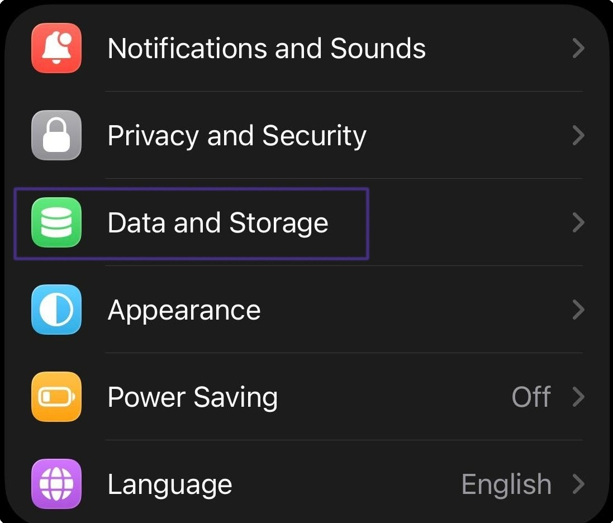
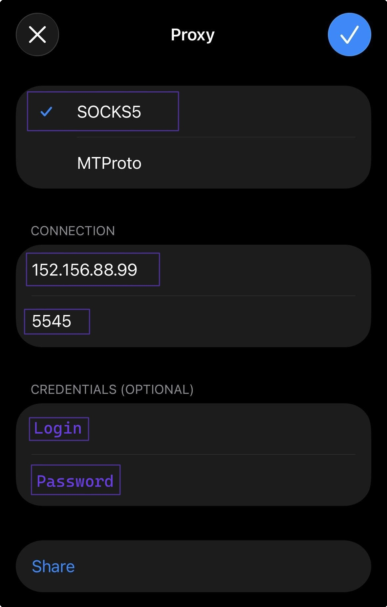

# Telegram

### Proxy setup for the Desktop version of Telegram

To set up a proxy in <mark style="color:purple;">Telegram</mark>, go to Settings.

<figure><figcaption></figcaption></figure>

Then open the "Advanced" settings.

<figure><figcaption></figcaption></figure>

Select the "TCP" connection type.

<figure><figcaption></figcaption></figure>

Next, specify the proxy connection.

Select the connection protocol that is convenient for you. HTTP is used by default.


**You can find a proxy setup example in the [Setup guide](getting-started.md) section**


<figure><figcaption></figcaption></figure>

Then check the connection and save it.

<figure><figcaption></figcaption></figure>

**Done! You can now use Telegram with our proxies.**

### Proxy setup for the Mobile version of Telegram

To set up a proxy on your phone, open settings and select "Data and Storage".

<figure><figcaption></figcaption></figure>

Then select "Proxy".

<figure><figcaption></figcaption></figure>

Select the SOCKS5 protocol and enter the proxy connection details.

<figure><figcaption></figcaption></figure>

Make sure to save the setting, and then you can use the proxy inside _Telegram._

