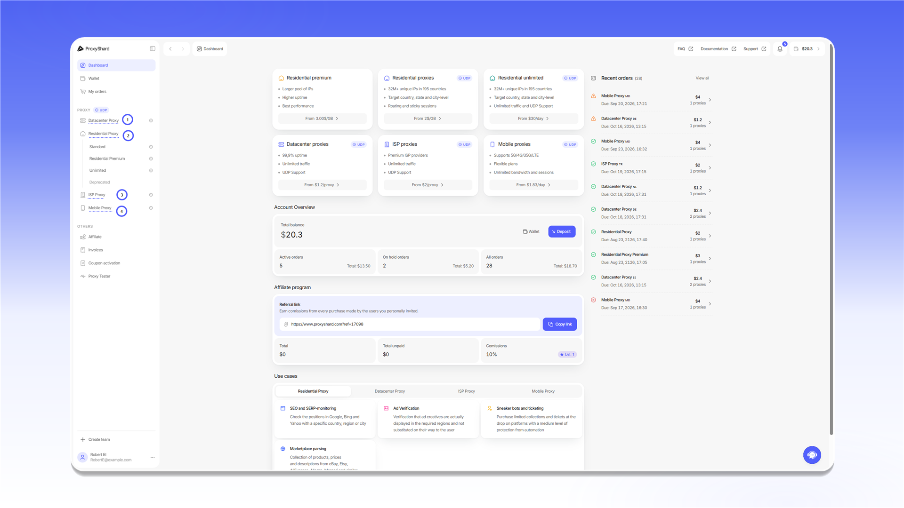

# Purchasing and renewing proxies


You need sufficient [funds](../top-up-balance.md) on your balance to pay for an order.


## Purchasing and managing orders

Select the required proxy type from the sidebar:

<figure>
  <picture>
    <source srcset="../../.gitbook/assets/proxy-product-navigation_black.png" media="(prefers-color-scheme: dark)">
    
  </picture>
</figure>

#### [**Purchasing Datacenter proxies**](buying-datacenter-proxies.md)

#### [**Purchasing residential proxies**](buying-residential-proxies.md)

#### [**Purchasing ISP proxies**](buying-isp-proxies.md)

#### [**Purchasing mobile proxies**](buying-mobile-proxies.md)
