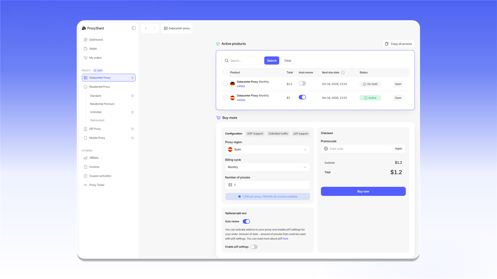

# Datacenter proxy purchase example

## Purchasing proxies

To purchase [datacenter proxies](https://dashboard.proxyshard.com/datacenter-proxy):

1. Open `Datacenter Proxy`.
2. Select the proxy country in `Proxy region`.
3. Select a payment period in `Billing cycle`.
4. Enter the number of proxies in `Number of proxies`.
5. Enable `Auto renew` if you want the order to renew automatically.
6. Enable `Enable p0f settings` if needed.
7. Enter the number of p0f slots in `Total slots`.
8. If you have a promo code, enter it in `Promocode` and click `Apply`.
9. Review the order total and click `Buy now`.

<figure>
  <picture>
    <source srcset="../../.gitbook/assets/datacenter-purchase-form_black.png" media="(prefers-color-scheme: dark)">
    
  </picture>
</figure>

## Paying for the order

After you click `Buy now`, an invoice with the `Unpaid` status opens. Check the `Total amount`, then click `Pay with Wallet`.

<figure>
  <picture>
    <source srcset="../../.gitbook/assets/datacenter-invoice-payment_black.png" media="(prefers-color-scheme: dark)">
    
  </picture>
</figure>

After payment, the order appears under `Active products` and in [`My orders`](https://dashboard.proxyshard.com/products). A paid order has the `Active` status.

<figure>
  <picture>
    <source srcset="../../.gitbook/assets/datacenter-active-products_black.png" media="(prefers-color-scheme: dark)">
    
  </picture>
</figure>


The proxies will start working within 1-2 minutes while the order is being synchronized.


## Renewing datacenter proxies

You can renew an order automatically or manually.

When `Auto renew` is enabled, the system attempts to renew the order 1-2 hours before the paid period ends. If the balance is sufficient, the payment is charged automatically and the proxies continue to work.

If automatic renewal is disabled or the balance is insufficient, the order receives the `On-hold` status. To renew it manually, open the order, click , and pay the new invoice.

<figure>
  <picture>
    <source srcset="../../.gitbook/assets/datacenter-order-details_black.png" media="(prefers-color-scheme: dark)">
    
  </picture>
</figure>


An order with the `Canceled` status cannot be renewed. This status is assigned after the order remains unpaid for three days.

