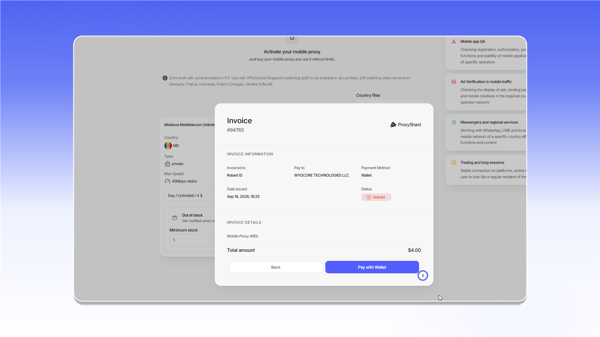
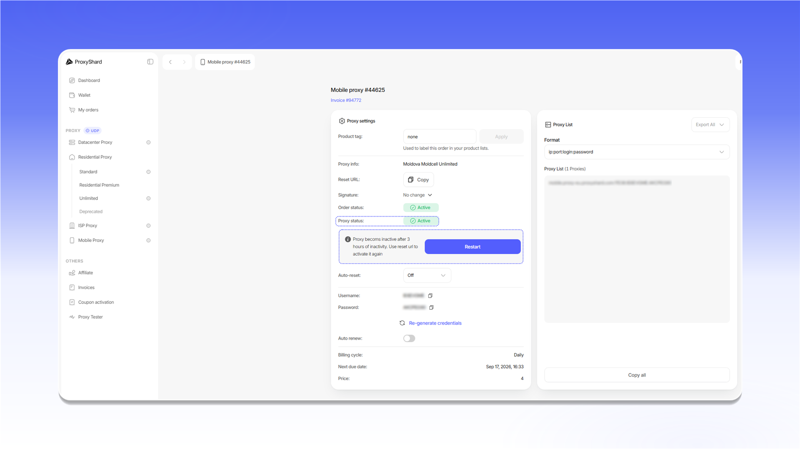
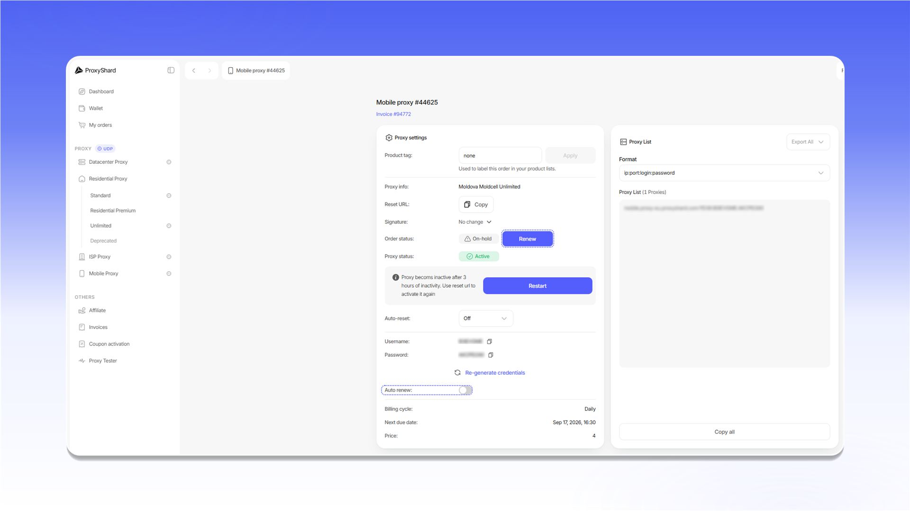

# Purchasing mobile proxies

## Purchasing proxies

To place an order:

1. Open `Mobile Proxy`.
2. Select a country with `Country filter`.
3. Choose a rental period on the card of the required carrier.
4. Click `Buy`.

<figure>
  <picture>
    <source srcset="../../.gitbook/assets/mobile-purchase-form_black.png" media="(prefers-color-scheme: dark)">
    
  </picture>
</figure>

## Paying for the order

Review the invoice total and click `Pay with Wallet`.

<figure>
  <picture>
    <source srcset="../../.gitbook/assets/mobile-invoice-payment_black.png" media="(prefers-color-scheme: dark)">
    
  </picture>
</figure>

After payment, the order appears under `Active products` and in [`My orders`](https://dashboard.proxyshard.com/products). Click `Open` to view its settings.

<figure>
  <picture>
    <source srcset="../../.gitbook/assets/mobile-active-products_black.png" media="(prefers-color-scheme: dark)">
    
  </picture>
</figure>

## Getting started

To activate the proxy after purchase, copy and open the `Reset URL`, or click `Restart`.

<figure>
  <picture>
    <source srcset="../../.gitbook/assets/mobile-order-restart_black.png" media="(prefers-color-scheme: dark)">
    
  </picture>
</figure>


The proxy becomes inactive after three hours without activity. Open the `Reset URL` again or click `Restart` to resume operation.


See the [mobile proxy guide](../../our-products/mobile-proxies.md) for descriptions of the order settings.

## Renewing the order

When `Auto renew` is enabled, the order renews automatically if the balance is sufficient. If automatic renewal is disabled, the order receives the `On-hold` status when the paid period ends. Open the order and click `Renew` to renew it manually.

<figure>
  <picture>
    <source srcset="../../.gitbook/assets/mobile-order-renewal_black.png" media="(prefers-color-scheme: dark)">
    
  </picture>
</figure>


An order with the `Canceled` status cannot be renewed. This status is assigned after three days without payment.

