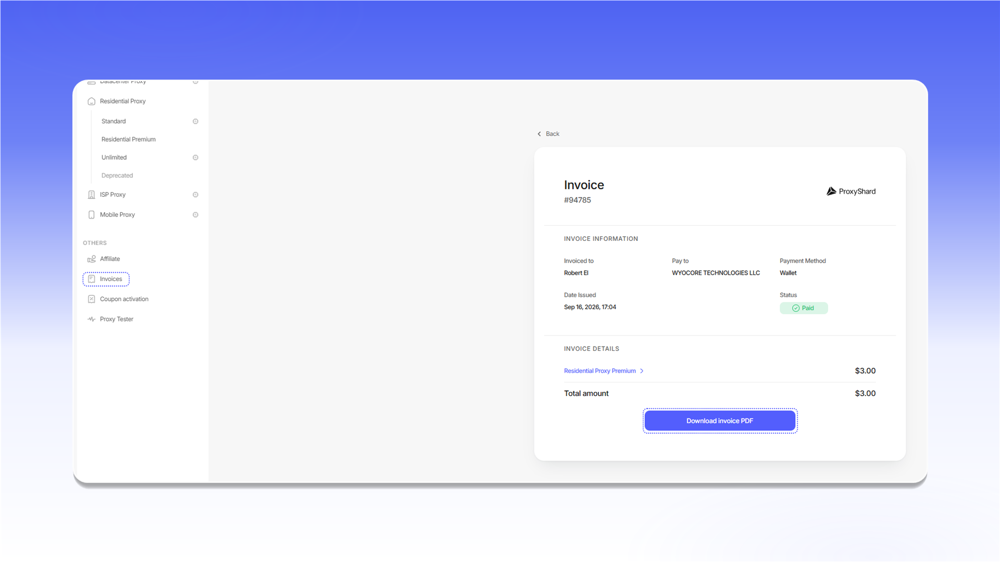

# Invoices

The `Invoices` section shows the total, date, and status of each invoice. Click `Open` to view an invoice.

<figure>
  <picture>
    <source srcset="../.gitbook/assets/invoice-list_black.png" media="(prefers-color-scheme: dark)">
    
  </picture>
</figure>

An invoice contains the payer details, payment method, status, and order items. Click `Download invoice PDF` to save it as a PDF.

<figure>
  <picture>
    <source srcset="../.gitbook/assets/invoice-details_black.png" media="(prefers-color-scheme: dark)">
    
  </picture>
</figure>
