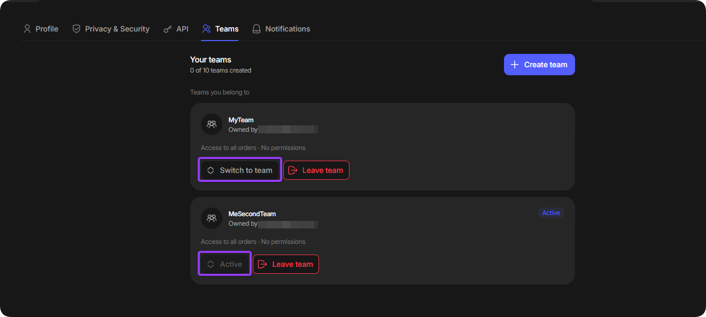

# Teamspaces

Teamspaces let you collaborate with other users, share access to proxies, assign roles, and manage orders in one workspace.

## Open Teamspaces

1. Click your profile icon in the lower-left corner of the dashboard.
2. Select **Settings**, then open the **Teams** tab in the top navigation.

<figure><figcaption></figcaption></figure>

## Manage teams

The **Teams** tab shows both teams you own and teams you belong to. You can create up to 10 teams.

For teams you belong to, use the available buttons to switch the active team or leave it.

<figure><figcaption></figcaption></figure>

For teams you own, you can manage members and configure team settings.

<figure><figcaption></figcaption></figure>

If you own the team, select **Settings** on its card to configure its workspace settings:

<figure><figcaption></figcaption></figure>

## Add members

1. Open the team and select **Members**.
2. Click **+ Add member** and enter the user's email address.

<figure><figcaption></figcaption></figure>

3. Set the required permissions for the member.

<figure><figcaption></figcaption></figure>
