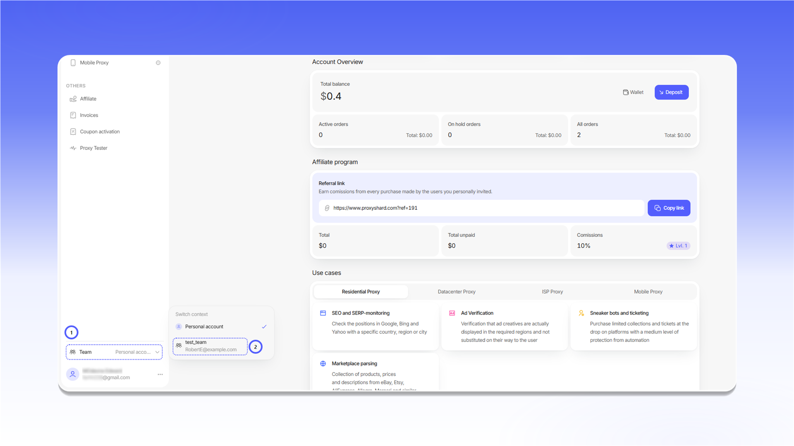
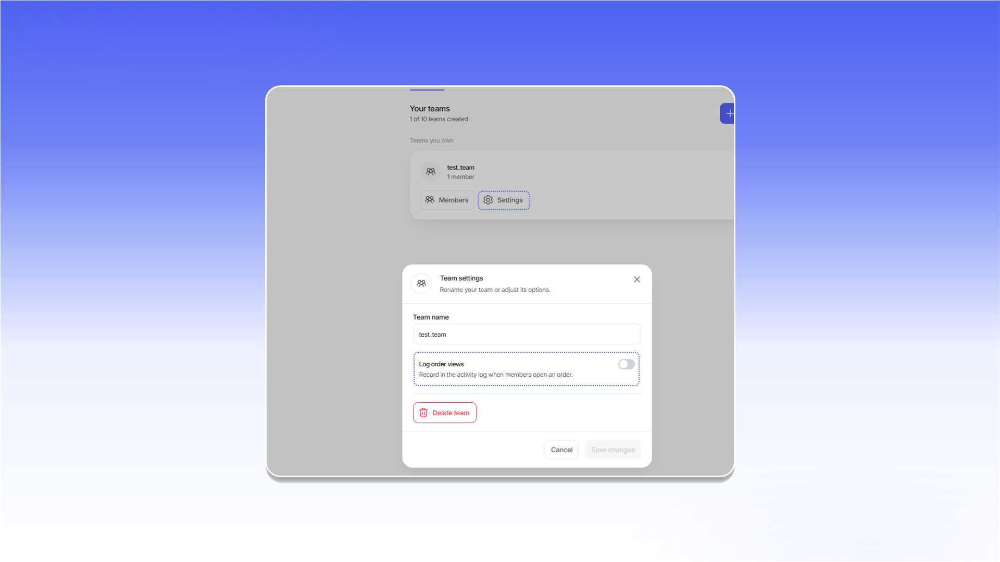
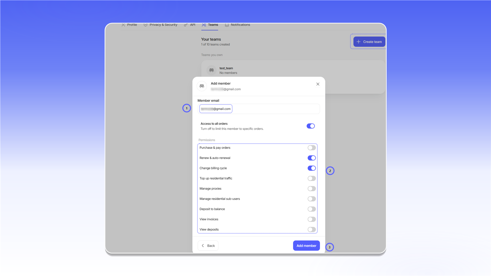

# Teamspaces

Teams let you share access to proxies and orders, assign permissions, and work in a shared workspace. One account can create up to 10 teams.

## Opening Teams

1. Click the profile icon in the lower-left corner.
2. Select `Settings`.
3. Open the `Teams` tab.

<figure>
  <picture>
    <source srcset="../.gitbook/assets/teams-navigation_black.png" media="(prefers-color-scheme: dark)">
    
  </picture>
</figure>

## Creating a team

1. Click `Create team`.
2. Enter a name in `Team name`.
3. Click `Create team` in the dialog.

<figure>
  <picture>
    <source srcset="../.gitbook/assets/team-create_black.png" media="(prefers-color-scheme: dark)">
    
  </picture>
</figure>

## Switching between teams

Open the account menu in the lower-left corner, select `Team`, then choose the required team. The interface will show the orders and features available to that team.

<figure>
  <picture>
    <source srcset="../.gitbook/assets/team-switch_black.png" media="(prefers-color-scheme: dark)">
    
  </picture>
</figure>

Teams you have joined appear under `Teams you belong to`. The current team has the `Active` status. Click `Leave team` to leave it.

<figure>
  <picture>
    <source srcset="../.gitbook/assets/team-membership_black.png" media="(prefers-color-scheme: dark)">
    
  </picture>
</figure>

## Team settings

The owner can open `Settings` on the team card, change the `Team name`, enable `Log order views`, or delete the team. Click `Save changes` after changing the settings.

<figure>
  <picture>
    <source srcset="../.gitbook/assets/team-settings_black.png" media="(prefers-color-scheme: dark)">
    
  </picture>
</figure>

## Adding members

Open `Members` on a team you own and click `Add member`. Then:

1. Enter an address in `Member email`.
2. Configure access to orders and the required permissions.
3. Click `Add member`.

<figure>
  <picture>
    <source srcset="../.gitbook/assets/team-add-member_black.png" media="(prefers-color-scheme: dark)">
    
  </picture>
</figure>
