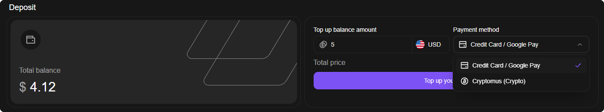

# Balance top-up

Adding funds is the most important step when working with the website.\
The balance is used to purchase all products on the website and to renew orders.\
\
The following top-up methods are currently supported:\
\- <mark style="color:purple;">Cryptocurrency</mark>, via Cryptomus\
\- <mark style="color:purple;">Bank card</mark>, via Stripe\
\
To top up your wallet balance, click "[Wallet](https://dashboard.proxyshard.com/en/wallet)"

On the top-up page, you can specify the amount and payment method.

<figure><figcaption></figcaption></figure>

Choose a payment method:

<figure><figcaption></figcaption></figure>

The top-up page also contains top-up history, where you can view paid invoices and export a PDF file for each invoice.

<figure><figcaption></figcaption></figure>
